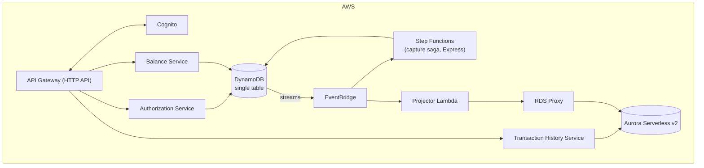
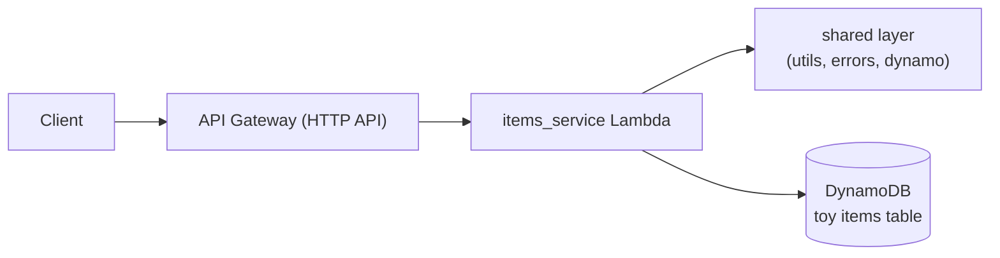

# PayLedger

[](https://github.com/Daniel-Ibarrola/PayLedger/actions/workflows/ci.yml)

A card authorization and double-entry ledger service on AWS serverless: place a hold, capture or void it,
read a balance, page through history. Built as a three-week ramp-up project to work through the patterns the
domain forces on you — idempotency, transactional integrity without a transaction manager, saga compensation,
CQRS, and cost discipline.

Money is integer minor units (cents) everywhere. No floats.

## Status

Skeleton stage. What is deployed today is `authorization_service`, a deliberately trivial CRUD pair over a one-key
placeholder table, whose only job is to prove the path **API Gateway → shared layer → boto3 → DynamoDB →
response** before any ledger semantics sit on top of it. It is shaped nothing like the real single-table
design so it can be deleted outright rather than migrated.

| | |
|---|---|
| ✅ Done | Terraform stack (HTTP API, Lambda, shared layer, DynamoDB, per-function IAM), remote state + GitHub OIDC deploy roles, CI (lint/format/tests) and CD (plan on PR, apply on merge), unit + integration tests against DynamoDB Local |
| 🔜 Week 1 | Domain model, single-table design, idempotency layer, `authorize`/`capture`/`void`, Hypothesis property test asserting the ledger always balances |
| 🔜 Week 2 | DynamoDB Streams → EventBridge, Step Functions capture saga with real compensation, Aurora Serverless v2 projector via RDS Proxy, observability |
| 🔜 Week 3 | Induced failures, DLQ replay CLI, k6 load test, write-up |

The design is further along than the code by design — see [`docs/design/`](docs/design/README.md), which
is the authority for the data model, API, invariants, ADRs, cost model, and security posture.

## Architecture

Target architecture:



Two databases, two jobs. DynamoDB is the source of truth for the write path and serves balance reads with a
strongly-consistent `GetItem`, because balance must always be current. Aurora is a derived, disposable read
model for transaction history and the analytics-shaped queries DynamoDB structurally cannot answer; if it
were lost it could be rebuilt from DynamoDB.

What actually exists today is the left edge of that diagram:



Key decisions are recorded as ADRs in the design doc: DynamoDB over Aurora for the write path, Step Functions
orchestration over choreography (and Express over Standard), provisioned concurrency/SnapStart over accepting
cold starts, single-table over multi-table, reversal entries over mutable ledger records, EventBridge over
direct SQS fan-out.

## Layout

```
src/layers/shared/     packaged as a Lambda layer; unpacked to /opt/python/shared
src/lambdas/<svc>/     one handler per service; ROUTES dict keyed on API Gateway route keys
infra/                 the deployed stack (S3 remote state, applied by CI)
infra/bootstrap/       one-off: state bucket + GitHub OIDC roles (local state, applied by hand)
tests/unit             no Docker, no AWS
tests/integration      DynamoDB Local via testcontainers
tests/e2e              runs against deployed resources
tests/http/            PyCharm HTTP Client requests against the live API
docs/                  design doc, runbook, roadmap
```

## Getting started

Prerequisites: [uv](https://docs.astral.sh/uv/), Python 3.13, Docker (for integration tests), Terraform ≥ 1.9,
and AWS credentials if you intend to deploy.

```bash
make install     # uv sync
make test        # unit + integration (starts DynamoDB Local in a container)
make lint        # ruff check + format --check
```

Run a single test the usual way:

```bash
uv run pytest tests/unit/test_shared_utils.py::TestRouteKey -v
```

## Deploying

The stack deploys itself: `terraform apply` on merge to `main` under a GitHub OIDC role, with a read-only
`terraform plan` posted as a comment on every PR. Nothing needs to be deployed by hand.

To deploy from a workstation instead, the state bucket and CI roles have to exist first. That is a one-time,
admin-credentials step:

```bash
terraform -chdir=infra/bootstrap init
terraform -chdir=infra/bootstrap apply    # state bucket + gha-payledger-{plan,apply} roles
```

Then, from the repo root:

```bash
make tf-init
make tf-apply
make tf-output      # api_base_url, table name, function name, log group
make http-env       # writes the API URL into the gitignored HTTP Client env file
```

There is no build step — the Lambda and layer zips are assembled inside `terraform plan` from `archive_file`
`source` blocks. That holds only while the shared layer stays pure first-party Python; the first third-party
dependency in `src/layers/shared/requirements.txt` turns it into a real `pip install -t` build against
manylinux/arm64.

Region defaults to `us-east-2`, Lambda to Python 3.13 on `arm64`. Everything tunable is in
`infra/variables.tf`; copy `infra/terraform.tfvars.example` to `terraform.tfvars` to override.

### Cost

The project targets **$10–30 total** for three weeks, which shapes the infrastructure more than any
performance concern: DynamoDB on-demand, no NAT Gateway, CloudWatch retention set explicitly on every log
group, a 10 rps / 20 burst throttle on the API, and Aurora created only in week 2 with a minimum of 0 ACU.
Set a budget alarm before deploying anything, and `make tf-destroy` when you are not actively testing.

[`docs/design/07-cost-model.md`](docs/design/07-cost-model.md) also carries a full production cost model at
100 TPS sustained (~$3,200/month, dominated by DynamoDB and API Gateway) — a separate exercise from the cost
of building it.

## API

Deployed today (**unauthenticated** until Cognito lands, which is why the API URL is kept out of git — see
[`tests/http/README.md`](tests/http/README.md)):

| Method | Path | |
|---|---|---|
| `POST` | `/items` | Full overwrite, last write wins. Requires `item_id`. |
| `GET` | `/items/{item_id}` | Strongly consistent read. |

Errors come back as `{"error": "NotFound", "message": "..."}`; internal failures never leak an exception
message.

Planned, per the design doc:

| Method | Path | |
|---|---|---|
| `POST` | `/authorizations` | Place a hold. Idempotent via `Idempotency-Key`. |
| `POST` | `/authorizations/{id}/capture` | Convert hold to a posted transaction, full amount, no body. |
| `POST` | `/authorizations/{id}/void` | Release the hold. |
| `GET` | `/accounts/me/balance` | Current and available balance, strongly consistent from DynamoDB. |
| `GET` | `/accounts/me/transactions` | Cursor-paginated history from Aurora, eventually consistent. |

Account-scoped routes are addressed as `me` and `POST /authorizations` carries no `account_id`: the account
is always the caller's validated Cognito `sub`. The shape is the access control — there is nowhere to put
someone else's account id.

## The invariants

The system is correct if these hold under concurrency and adversarial input:

1. For every transaction, the sum of all ledger entries equals zero.
2. `available_balance = current_balance - sum(active_holds)`, at all times.
3. An authorization can be captured at most once, for exactly its authorized amount.
4. Replaying a request with the same idempotency key returns the original response, never a second effect.
5. Expired holds (default 7 days) release automatically.

Posted ledger entries are never mutated or deleted; corrections are new opposite-sign entries under a new
transaction id. That rule is enforced in IAM as well as in code — every role except `CompensateLedger` carries
an explicit `Deny` on `dynamodb:DeleteItem`.

## Docs

- [`docs/design/`](docs/design/README.md) — **the source of truth.** Data models, single-table design,
  ADRs, cost model, security, and an explicit list of the sections still missing. Where any other document
  disagrees with it, it wins.
- [`docs/runbook.md`](docs/runbook.md) — what to do at 3am when the ledger is out of balance, the DLQ is
  filling, the projection is lagging, Aurora is at max ACU, or RDS Proxy is out of connections.
- [`docs/roadmap.json`](docs/roadmap.json) — every task across the three weeks with its current status,
  dependencies, and the invariant it protects.
