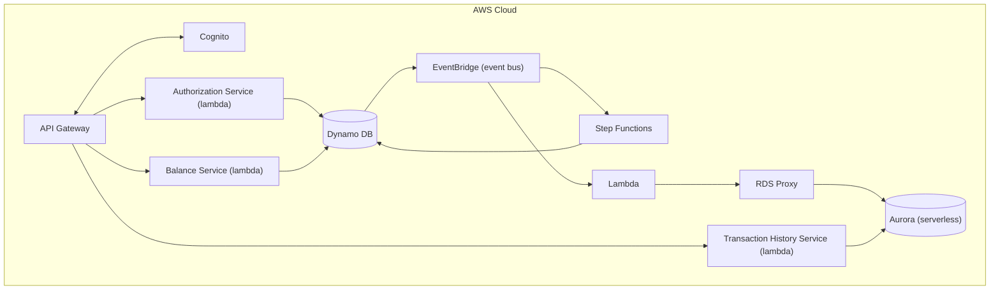

# Payledger System

## Overview

### Objective

To build a card authorization and double-entry ledger system. This system should allow users to authorize
payments and manage their accounts by viewing their balance and their transaction history.

### Scope

In scope: placing an authorization hold, capturing a hold into a posted transaction, voiding a hold, querying an
account's current and available balance, and paginated transaction history.

Explicitly out of scope: multi-currency/FX, interest accrual, statement generation, chargebacks/disputes, and
**partial capture** — a capture is all-or-nothing for the full authorized amount. These
are deliberate exclusions, not omissions — they keep the invariant surface (hold lifecycle + double-entry balance)
tractable within the project's timeline.


### Success Criteria

The system is considered correct if the following invariants hold under all conditions, including concurrent
requests and randomized/adversarial input:

1. For every transaction, the sum of all ledger entries equals zero.
2. `available_balance = current_balance - sum(active_holds)`, at all times.
3. An authorization can be captured at most once, for exactly its authorized amount.
4. Replaying a request with the same idempotency key returns the original response, never a second effect. The one
   exception is a capture the saga later reverses: compensation invalidates the idempotency record, so a replay
   re-executes and fails the `PENDING` guard rather than returning a stale success.
5. Expired holds (default 7 days) release automatically, without manual intervention.

### Functional Requirements

- Users should be able to view their account's balance
- Users should be able to view their transaction history
- Users should be able to authorize payments 

### Non-Functional Requirements

- Maintain financial integrity by preventing double charges (Idempotency)
- The transaction history can have eventual consistency. However, reading balances must always
return the latest value.

### User Experience

The interaction is done only through the exposed rest endpoints. There will be no GUI or other modes
of interaction.

### Cloud Architecture



Balance reads go to DynamoDB with a strongly-consistent `GetItem`, not to Aurora — the non-functional requirement
says balance must always return the latest value, and Aurora is by construction an eventually-consistent derived
model. Transaction history goes to Aurora, where eventual consistency is acceptable.

#### Data flow

**Authorizing payments**
1. A customer has $500 in their account.
2. Customer books a hotel room at $400
```
POST /authorizations
Idempotency-Key: 7c3a1e2f-...
{
  "account_id": "acct_123",
  "amount": 40000,        // cents
  "merchant_id": "mrch_456",
  "expires_in_days": 7
}
```
3. Write `Authorization` record for $400 with pending status. `current_balance` stays $500 (no money has moved).
`available_balance` becomes $100 ($500 - $400 hold).
The customer's other card swipes will now only succeed if they're ≤ $100.
4. Capture the payment. The capture takes no body — it is always for the full authorized amount.
```
POST /authorizations/{authId}/capture
Idempotency-Key: 9f2b4d1c-...
```
Update the authorization record status to captured. Write two new ledger entries (debit the account, credit the
merchant). `current_balance` becomes $100. `available_balance` stays $100 — the hold is released at the same moment
the money leaves, so the two changes cancel out.
5. Alternative, the payment gets canceled.
```
POST /authorizations/{authId}/void
Idempotency-Key: 3e8a7b5d-...
```
Update authorization record to voided. `current_balance` stays $500, `available_balance` goes back to $500.
6. Alternative, the capture is reversed by the saga (fraud flagged, or settlement permanently failed). Write a
balanced REVERSAL transaction, restore `current_balance` to $500 and `available_balance` to $500, and move the
authorization to `REVERSED`. The original ledger entries are never touched.

### Data Models

All monetary amounts are integer **minor units (cents)**. No floats anywhere; `Decimal` is used only at the
presentation boundary if a decimal representation is ever needed.

**Account**
- account_id (str)
- current_balance (int)
- available_balance (int)

`available_balance` is materialized rather than derived so that a balance read is a single `GetItem` instead of a
query summing every active hold. The cost of that choice is that it must be maintained transactionally by every
operation that touches a hold — authorize, capture, void, expiry, reversal — and the sufficient-funds
`ConditionExpression` guards it at **authorize** time, which is the only moment the check is meaningful. Invariant 2
therefore becomes an assertion to test against (the property-based test recomputes it from the holds), not the
mechanism by which the value is produced.

**Merchant**
- merchant_id (str)
- name (str)
- payable_balance (int) — the merchant's side of the ledger; credited on capture, debited on reversal
- created_at (str) — ISO-8601 UTC

Merchants are the counterparty on every transaction. They are a distinct entity rather than a kind of account: they
have no holds, no available balance, and no authorization lifecycle, so folding them into `Account` would mean an
entity where half the fields are permanently unused.

**Authorization**
- authorization_id (str)
- account_id (str)
- merchant_id (str)
- status (enum PENDING, CAPTURED, VOIDED, EXPIRED, REVERSED)
- amount (int) — the authorized amount; a capture is always for exactly this amount
- expires_at (str) — ISO-8601 UTC; the attribute the sparse expiry GSI is keyed on
- created_at (str) — ISO-8601 UTC
- updated_at (str) — ISO-8601 UTC

`expires_in_days` is a *request* field only. It is resolved to an absolute `expires_at` at write time, because the
expiry sweep needs an absolute value to range-query against.

Because partial capture is out of scope, there is no `captured_amount` and no `PARTIALLY_CAPTURED` status: the
`PENDING → CAPTURED` transition guarded by a `ConditionExpression` is the whole of invariant 3's enforcement.

**Ledger Entry**
- transaction_id (str)
- party_id (str) — the account or merchant this entry belongs to
- party_type (enum ACCOUNT, MERCHANT)
- source_authorization_id (str)
- amount (int)
- entry_type (enum DEBIT, CREDIT)
- created_at (str) — ISO-8601 UTC, matches the timestamp embedded in the sort key

An entry belongs to a *party*, not specifically an account, because the credit side of every transaction lands on a
merchant. `party_type` mirrors the key prefix (`ACCT#` / `MERCHANT#`) so an entry can be resolved back to its owner
without a second lookup.

**Idempotency**
- idempotency_key (str)
- request_hash (str) — hash of the request body; a replay with the same key but a different payload is a 422, not a
  silent replay of the original response
- status (enum IN_PROGRESS, COMPLETED) — lets a retry distinguish "still running" from "done", which is what makes
  the crash-after-write-before-response case recoverable
- response_snapshot (json) — the original response, returned verbatim on replay
- ttl (int) — epoch seconds, 24–48h

Saga compensation **deletes** the idempotency record for a capture it reverses. Returning the stored success
snapshot after the money has been reversed would be a lie about current state; deleting it means a replay
re-executes the capture, hits the `PENDING` guard against a now-`REVERSED` authorization, and returns a terminal
error instead.

### API

The API will consist of the following endpoints

| Method | Path | Notes |
|---|---|---|
| `POST` | `/authorizations` | Place a hold. Idempotent via `Idempotency-Key` header. |
| `POST` | `/authorizations/{id}/capture` | Convert hold to posted transaction, for the full authorized amount. No body. Idempotent via `Idempotency-Key`. |
| `POST` | `/authorizations/{id}/void` | Release the hold. Idempotent via `Idempotency-Key`. |
| `GET` | `/accounts/{id}/balance` | Returns both current and **available** balance. Served from DynamoDB, strongly consistent. |
| `GET` | `/accounts/{id}/transactions` | Paginated history, cursor-based. Served from Aurora, eventually consistent. |

Account, merchant, and authorization identifiers are opaque strings in the public API. The `ACCT#` / `MERCHANT#` /
`AUTH#` prefixes in the table design below are an internal key encoding and are never exposed to or accepted from
clients.


## Design Decisions

### DynamoDB

We use DynamoDB as the database for the write path using a single table design. 

**Access patterns to satisfy:**

1. Get account by ID
2. Get merchant by ID
3. Get authorization by ID
4. List authorizations for an account, newest first
5. List ledger entries for a party, by date range — for integrity checks and projection rebuild, **not** for the
   transaction-history endpoint, which is served from Aurora
6. Get every entry of one transaction, to verify it sums to zero
7. Look up an idempotency record by key
8. Find expired holds for release

**Table design:**

| Entity | PK | SK | GSI1PK | GSI1SK |
|---|---|---|---|---|
| Account | `ACCT#<id>` | `META` | — | — |
| Merchant | `MERCHANT#<id>` | `META` | — | — |
| Authorization | `ACCT#<id>` | `AUTH#<ts>#<authId>` | `AUTH#<authId>` | `META` |
| Ledger entry | `<party>` | `TXN#<ts>#<txnId>#<seq>` | `TXN#<txnId>` | `ENTRY#<seq>` |
| Idempotency | `IDEM#<key>` | `META` | — | — |

`<party>` is either `ACCT#<id>` or `MERCHANT#<id>` — both sides of a transaction use the same sort-key shape, so the
zero-sum check (access pattern 6) is one GSI1 query regardless of who the counterparty is.

Notes:

- Sort keys are time-prefixed so range queries and reverse scans come free.
- GSI1 handles lookup-by-id when you don't know the account.
- Idempotency records get a **TTL** attribute (24–48h). Free cleanup.
- Expired-hold sweep: a sparse GSI keyed on `expires_at` for holds only. Preferred over a TTL-driven stream event
  because TTL deletion timing is not guaranteed and can lag by hours — unacceptable for an invariant that says holds
  release automatically.
- Watch for hot partitions on high-volume accounts. Know what write sharding would look like even if you don't implement it.

**Placing a hold**

Authorize is where the sufficient-funds decision is made, so it is where the guard belongs. Nothing moves in
`current_balance` — only the reservation is taken.

```
TransactWriteItems([

  // 1. Reserve the funds. This ConditionExpression IS the overdraft
  //    protection; nothing downstream re-checks it.
  Update {
    PK: "ACCT#alice", SK: "META",
    UpdateExpression: "SET available_balance = available_balance - :amt",
    ConditionExpression: "available_balance >= :amt",
    Values: { ":amt": 7500 }
  },

  // 2. The hold itself, with an absolute expiry for the sweeper's GSI
  Put {
    PK: "ACCT#alice",
    SK: "AUTH#2026-07-30T10:00:00Z#auth-001",
    ConditionExpression: "attribute_not_exists(PK)",
    status: "PENDING",
    amount: 7500,
    merchantId: "mrch_bobs-store",
    expires_at: "2026-08-06T10:00:00Z"
  },

  // 3. Idempotency record
  Put {
    PK: "IDEM#<authorize-idempotency-key>", SK: "META",
    ConditionExpression: "attribute_not_exists(PK)",
    requestHash: "...", status: "COMPLETED",
    responseSnapshot: {...}, ttl: ...
  }
])
```

A `TransactionCanceledException` here needs `CancellationReasons` read positionally to tell the two failure modes
apart: item 1 failing is *insufficient funds*, item 3 failing is *a replayed idempotency key*. They are different
HTTP responses and conflating them is the easy bug.

**Updating the ledger**

When we capture an authorization we'll use DynamoDB `TransactWriteItems` to ensure that the ledger entries are created
and the account balance is properly updated

Note what capture does **not** do: it does not re-check sufficient funds. The money was already reserved at
authorize time, and re-testing `current_balance` here would spuriously fail a legitimate capture whenever other
holds have since been placed against the same account. Capture's only guard is the authorization's own state.

For example:

```
TransactWriteItems([

  // 1. Debit Alice's account balance. available_balance is untouched:
  //    the hold is released and the money leaves in the same instant,
  //    so the two changes cancel out exactly.
  Update {
    PK: "ACCT#alice", SK: "META",
    UpdateExpression: "SET current_balance = current_balance - :amt",
    Values: { ":amt": 7500 }
  },

  // 2. Credit the merchant's payable balance
  Update {
    PK: "MERCHANT#bobs-store", SK: "META",
    UpdateExpression: "SET payable_balance = payable_balance + :amt",
    Values: { ":amt": 7500 }
  },

  // 3. Ledger entry: debit (money leaving Alice's account)
  Put {
    PK: "ACCT#alice",
    SK: "TXN#2026-07-30T10:05:00Z#txn-500#0",
    txnId: "txn-500",
    partyType: "ACCOUNT",
    entryType: "DEBIT",
    amount: 7500,
    sourceAuthId: "auth-001"
  },

  // 4. Ledger entry: credit (money arriving in merchant payable)
  Put {
    PK: "MERCHANT#bobs-store",
    SK: "TXN#2026-07-30T10:05:00Z#txn-500#1",
    txnId: "txn-500",
    partyType: "MERCHANT",
    entryType: "CREDIT",
    amount: 7500,
    sourceAuthId: "auth-001"
  },

  // 5. Close the authorization. This ConditionExpression is the whole
  //    of invariant 3 — one capture, full amount, no second effect.
  //    `status` is a DynamoDB reserved word, so it must go through
  //    ExpressionAttributeNames as #status.
  Update {
    PK: "ACCT#alice", SK: "AUTH#...#auth-001",
    UpdateExpression: "SET #status = :captured",
    ConditionExpression: "#status = :pending",
    Names:  { "#status": "status" },
    Values: { ":captured": "CAPTURED", ":pending": "PENDING" }
  },

  // 6. Idempotency record
  Put {
    PK: "IDEM#<capture-idempotency-key>",
    SK: "META",
    ConditionExpression: "attribute_not_exists(PK)",
    requestHash: "...", status: "COMPLETED",
    responseSnapshot: {...},
    ttl: ...
  }
])
```

**Reversing a capture**

When the saga compensates (see Step Functions below), the reversal is itself a balanced transaction. It restores
both balances, moves the authorization to a terminal `REVERSED`, and deletes the capture's idempotency record so a
replay cannot return a success snapshot that no longer reflects reality.

```
TransactWriteItems([

  // 1-2. Restore both balances. available_balance moves with
  //      current_balance because the hold is already gone.
  Update {
    PK: "ACCT#alice", SK: "META",
    UpdateExpression: "SET current_balance   = current_balance   + :amt,
                           available_balance = available_balance + :amt",
    Values: { ":amt": 7500 }
  },
  Update {
    PK: "MERCHANT#bobs-store", SK: "META",
    UpdateExpression: "SET payable_balance = payable_balance - :amt",
    Values: { ":amt": 7500 }
  },

  // 3-4. Two NEW opposite-sign entries under a new txnId. The original
  //      entries are never touched — see ADR-5.
  Put { PK: "ACCT#alice",             SK: "TXN#...#txn-501#0",
        entryType: "CREDIT", amount: 7500, reversalOf: "txn-500" },
  Put { PK: "MERCHANT#bobs-store",    SK: "TXN#...#txn-501#1",
        entryType: "DEBIT",  amount: 7500, reversalOf: "txn-500" },

  // 5. Terminal state, guarded so a duplicate compensation is a no-op
  Update {
    PK: "ACCT#alice", SK: "AUTH#...#auth-001",
    UpdateExpression: "SET #status = :reversed",
    ConditionExpression: "#status = :captured",
    Names:  { "#status": "status" },
    Values: { ":reversed": "REVERSED", ":captured": "CAPTURED" }
  },

  // 6. Invalidate the capture's idempotency record
  Delete { PK: "IDEM#<capture-idempotency-key>", SK: "META" }
])
```

**Why not use a relational database?**

DynamoDB has several advantages over a relational database. It is serverless, can scale automatically and is highly 
available by default. DynamoDB also supports transactions which will help us ensure atomicity when dealing with 
financial transactions, ensuring data integrity. As we'll run on demand the initial costs will be much less that 
having an Aurora Cluster or an RDS cluster.

### Aurora Serverless

Aurora is used in serverless mode for the read path. We use a separate database as the access patterns are different
for the read path. As we'll be using lambda we'll use RDS proxy to pool and share database connections.

**Why a second database at all?**

DynamoDB is built to satisfy the fixed, known-in-advance access patterns above — it is structurally unable to answer
ad hoc questions: aggregations, joins, arbitrary date-range scans, "top merchants by spend last quarter." Aurora
Postgres exists purely to serve that class of query. This gives the system two databases with two different jobs
rather than one database stretched past its access-pattern fit: DynamoDB is the source of truth for the write path,
Aurora is a derived, disposable read model. If Aurora were lost entirely, it could be rebuilt from DynamoDB.

Aurora serves `GET /accounts/{id}/transactions`. Balance is deliberately *not* served from here — it must be
current, and Aurora is eventually consistent by construction.

It is worth being honest about the strength of this argument at the current scope. Transaction history alone could
be served from DynamoDB: the ledger-entry sort key is already time-prefixed and paginating it is a `Query` with a
`LastEvaluatedKey` cursor. The justification for the second database is the *analytics* class of query, which is not
yet in scope. Aurora is therefore carried here on the strength of what it enables next, and because standing up a
CQRS read path — projector, at-least-once handling, projection lag, rebuild-from-scratch — is a deliberate goal of
this project rather than an incidental cost of it. A production system at this scope with no analytics roadmap
should use one database.

**How data gets there**

```
DynamoDB Streams → Lambda projector → Aurora Serverless v2 (via RDS Proxy)
```

A Lambda projector consumes the DynamoDB stream and writes into Aurora using `psycopg` (v3). This is the CQRS
pattern: DynamoDB owns writes, Aurora is eventually consistent and exists only to serve reads that need SQL. Because
streams deliver **at-least-once**, the projector must be idempotent — each record carries a monotonic sequence
number, and the projector upserts using that sequence to discard replays rather than double-apply them. Because the
projection is derived, it must also support a full **rebuild from scratch** (replaying the table from a DynamoDB
export) if the projector logic changes or the read model needs to be repaired.

**Why RDS Proxy**

Lambda invocations scale out independently and can burst to hundreds of concurrent executions; each one opening its
own Postgres connection will exhaust Aurora's connection limit long before it exhausts CPU or ACU capacity. RDS
Proxy sits in front of Aurora and pools/multiplexes connections so bursty, concurrent Lambda invocations don't take
the database down. Connecting Lambda straight to Postgres is the failure mode to design around deliberately, not
discover in production.

**Cost posture**

Aurora Serverless v2 is configured with **minimum capacity of 0 ACUs**, so it scales to zero and stops billing
compute when idle. This only works if nothing keeps a connection open — a stray RDS Proxy connection or a forgotten
debugging session will keep it warm indefinitely. Aurora is provisioned only once the write path and projector are
in place, not from day one.

### Step Functions

An **Express** workflow kicks in after the ledger write succeeds, triggered via DynamoDB Streams → EventBridge, to
orchestrate what happens next: fraud screening, settlement submission, and notification — three separate calls that
can each fail independently.

**Express, with execution logging explicitly enabled.** This is the one piece of configuration that must not be
skipped. Express workflows do **not** retain queryable execution history the way Standard does — the console shows
little, and "which state did this `authId` fail in?" is unanswerable unless the state machine is configured to log
execution data to CloudWatch Logs (log level `ALL`, including execution data). That logging is opt-in, it costs
money, and turning it off to save a few dollars silently removes the debugging surface the runbook depends on
during an incident. Treat it as part of the workflow definition, not an observability nice-to-have.

Two Express constraints the saga has to live within:

- **5-minute execution ceiling.** `SubmitSettlement` retries with backoff, so the retry policy has to fit inside
  that budget — an unbounded backoff would have the workflow time out rather than reach `CompensateLedger`, which
  would leave a capture posted with no compensation. The retry count and max interval are a correctness concern
  here, not a tuning knob.
- **At-least-once execution.** An Express workflow triggered asynchronously can run more than once for the same
  event, so every step must be safe to repeat. Compensation already is: its `ConditionExpression` requires
  `CAPTURED`, so a second run is a no-op rather than a double reversal.

See ADR-2 for why Express over Standard.

**Fraud screening runs after the money moves.** This is deliberate and worth stating plainly, because the
conventional design gates the *authorization* on fraud. Here the ledger write is authoritative and fraud screening
is a downstream reviewer, so a `FLAGGED` result is handled by compensation rather than by refusal. The reason is
that exercising a real compensating transaction — with the reversal semantics of ADR-5 — is a primary goal of this
project, and a pre-authorization fraud check never produces one. A production system would screen at authorization
and keep compensation for the settlement failures that genuinely cannot be known in advance.

**The saga shape**

```
1. FraudScreen
   → APPROVED or FLAGGED
   → if FLAGGED: go to CompensateLedger, end.

2. SubmitSettlement
   → the step most likely to fail (simulated network/acquirer)
   → retries with backoff; if still failing: go to CompensateLedger, end.

3. NotifyCustomer
   → if this fails, just retry/log — a failed notification is never
     a reason to reverse a real payment.

CompensateLedger (only reached from steps 1 or 2 failing):
   → writes a balanced REVERSAL transaction — new opposite-sign entries
     under a new txnId, never deletes/edits the originals, per ADR-5.
   → restores current_balance and available_balance on the account,
     and payable_balance on the merchant.
   → moves the authorization PENDING→...→REVERSED (terminal).
   → deletes the capture's idempotency record, so a client replay
     re-executes and fails the PENDING guard instead of replaying a
     success snapshot that is no longer true.

   All five of these happen in one TransactWriteItems — see
   "Reversing a capture" above. A compensation that partially applied
   would itself break the invariant it exists to protect.
```

**Why it needs an orchestrator, not just chained Lambdas**

- Compensation logic (undoing a capture if a later step fails) is explicit and visible in the state machine, not buried in `try/except` blocks.
- Retries/backoff per step are declarative, not hand-rolled.
- Long-running steps don't tie up a billed Lambda invocation.
- Execution history is available per execution — for any `authId`, exactly which state ran, failed, or succeeded is
  answerable. This is what the runbook leans on during an incident, and on Express it exists only because execution
  logging is switched on deliberately.

**Since there's no real fraud model or card network, both steps are simulated**

**Fraud screen** — deterministic rules, not ML, plus a random-injection knob so you can reliably force the `FLAGGED` path in tests:

```python
def fraud_screen(event, context):
    amount = event["amount"]
    account_id = event["accountId"]

    if amount > 100_000:
        return {"decision": "FLAGGED", "reason": "amount_threshold"}
    if is_velocity_exceeded(account_id):
        return {"decision": "FLAGGED", "reason": "velocity"}
    if random.random() < 0.05:
        return {"decision": "FLAGGED", "reason": "random_test_injection"}
    return {"decision": "APPROVED"}
```

**Settlement submission** — a stand-in for "the outside world" that misbehaves on command via an env var, so you can trigger compensation deliberately during chaos testing rather than waiting for a real edge case:

```python
def submit_settlement(event, context):
    outcome = os.environ.get("SETTLEMENT_TEST_MODE", "normal")

    if outcome == "always_fail":
        raise SettlementTimeoutError("simulated acquirer timeout")
    if outcome == "flaky":
        if random.random() < 0.3:
            raise SettlementTimeoutError("simulated transient failure")
        time.sleep(random.uniform(0.5, 2))
    if outcome == "always_reject":
        return {"status": "REJECTED", "reason": "simulated_decline"}

    return {"status": "SETTLED", "settlementId": str(uuid.uuid4())}
```

## Architecture Decision Records

Each ADR states the decision, the alternative rejected, the reasoning, and the condition under which it would be
revisited.

### ADR-1: DynamoDB over Aurora for the write path

**Decision:** The write path (accounts, authorizations, ledger entries, idempotency records) is DynamoDB, not
Aurora/Postgres.

**Rejected:** Aurora as the single database for both writes and reads.

**Rationale:** The write path's access patterns are fixed and known in advance (get by ID, list by account, look up
idempotency key) — exactly what a single-table DynamoDB design is built for. `TransactWriteItems` gives atomic,
conditional multi-item writes, which is what's needed to move a hold and write ledger entries together. DynamoDB is
also serverless with true scale-to-zero economics on-demand, whereas an always-on Aurora writer has a floor cost
even when idle.

**Revisit when:** the write path needs ad hoc queries, multi-row joins, or strong relational constraints that
outgrow what a handful of fixed access patterns can express — at that point the operational cost of running
Aurora as the primary store may be worth it.

### ADR-2: Step Functions orchestration over pure event choreography

**Decision:** The capture saga (fraud screen → settlement submission → notification) is orchestrated with Step
Functions **Express** workflows with execution logging enabled, with explicit compensating transactions on failure.

**Rejected:** Pure choreography — each service reacting to the previous service's event with no central
coordinator. Also rejected: Standard workflows for the saga.

**Rationale:** A multi-step financial saga needs a single place that knows the full sequence, can time out, and can
run reversal logic when a downstream step fails. Choreography spreads that knowledge across every consumer, making
"what state is this capture actually in?" hard to answer and hard to debug during an incident.

Express over Standard is the second half of this decision, and it is a cost decision made with open eyes. Standard
retains per-execution history natively for 90 days with no configuration, which is genuinely the better debugging
experience. But Standard bills **per state transition** where Express bills **per execution plus duration**: on
this cost model's own numbers, the same saga is roughly $3,900/month on Standard against roughly $60/month on
Express — a ~60× difference for a debugging convenience, not a capability. Express buys back most of that
capability by logging execution data to CloudWatch Logs, at a cost of tens of dollars rather than thousands.

The trade is explicit: Express is chosen, and the CloudWatch Logs configuration that makes it debuggable is treated
as mandatory rather than optional. An Express workflow without execution logging would be the worst of both worlds
— cheap and undiagnosable.

**Revisit when:** *(a)* the number of independently-scaling, loosely-coupled consumers grows large enough that a
central orchestrator becomes a bottleneck or a single point of coordination failure — at that point event
choreography (or a mix, with orchestration only for the compensating-transaction-critical steps) is worth
reconsidering; or *(b)* the saga needs to exceed Express's **5-minute** ceiling or needs the stronger
exactly-once-style execution semantics Standard provides, at which point Standard's state-transition bill becomes
the price of correctness rather than of convenience. A hybrid — Express on the happy path, Standard reserved for
the compensation branch — is the middle option if only the reversal path needs that guarantee.

### ADR-3: Provisioned concurrency / SnapStart over accepting cold starts

**Decision:** Latency-sensitive Lambdas (the synchronous write path: authorize/capture/void, balance reads) use
either provisioned concurrency or SnapStart rather than accepting on-demand cold starts.

**Rejected:** Accepting cold starts as-is, relying only on Lambda's default warm-pool behavior.

**Rationale:** Card authorization is a synchronous, user-facing call — a multi-second cold start on `POST
/authorizations` is a bad customer experience and, at the margin, a lost sale (the same pressure card networks
apply with their own timeout budgets). SnapStart (Python support as of late 2024) and provisioned concurrency both
remove that tail at different cost/complexity trade-offs, worth measuring against each other under load rather than
assumed.

**Revisit when:** traffic is high and steady enough that the Lambda stays warm on its own, or cost pressure makes the
provisioned-concurrency/SnapStart overhead not worth a tail-latency improvement nobody is measuring.

### ADR-4: Single-table over multi-table DynamoDB design

**Decision:** Accounts, authorizations, ledger entries, and idempotency records all live in one DynamoDB table,
distinguished by key prefix, per the table design above.

**Rejected:** A separate table per entity type.

**Rationale:** The core write operation — capture — must atomically touch the account balance, ledger entries, the
authorization status, and the idempotency record in one `TransactWriteItems` call. DynamoDB transactions are
constrained more easily (and cheaply) within a single table, and a single table also means one set of
capacity/throughput knobs to reason about instead of several. The access-pattern list was enumerated up front
specifically to make this single-table design tractable.

**Revisit when:** an entity's access patterns diverge so far from the others (radically different read/write
volume, different scaling or backup requirements) that sharing a table creates more operational coupling than the
transactional convenience is worth.

### ADR-5: Reversal entries over mutable ledger records

**Decision:** Correcting a posted transaction (e.g. a failed settlement after capture) is done by writing new,
opposite-sign ledger entries — never by updating or deleting the original entries.

**Rejected:** Mutating or deleting the original ledger entry to "fix" it.

**Rationale:** The core invariant is that every transaction's entries sum to zero and the ledger is an append-only,
auditable record — a requirement that comes directly from the domain, not a technical preference. A mutated ledger
is no longer a trustworthy audit trail: it can't answer "what did the balance look like at 3pm yesterday" or survive
a dispute investigation. A reversal is itself a balanced transaction, so the zero-sum invariant holds through
corrections, not just through the happy path.

**Revisit when:** never, for posted entries — this is a hard invariant of the domain, not a scoping choice. (Ledger
entries for an authorization that is still `PENDING`, i.e. a hold with no posted movement, are not in scope of this
rule.)

### ADR-6: EventBridge over direct SQS fan-out

**Decision:** DynamoDB Streams feed EventBridge, which fans out to Step Functions and to the Aurora projector,
rather than the stream feeding SQS queues directly.

**Rejected:** Direct SQS fan-out from the stream consumer to each downstream consumer.

**Rationale:** EventBridge decouples "an event happened" from "who currently cares about it" — new consumers (a
second projector, a fraud-analytics stream) can subscribe via a rule without touching the producer or existing
consumers, and schema/versioning is centralized at the bus rather than duplicated per queue. SQS still sits between
EventBridge and each individual consumer for buffering, retry, and DLQ semantics — EventBridge and SQS are
complementary here, not a replacement for one another.

**Revisit when:** the event volume is high enough, or the fan-out pattern static enough, that EventBridge's
per-event cost and added hop stop being worth the routing flexibility — a fixed, small number of consumers may be
simpler and cheaper wired directly to SQS.

## Cost Model

This estimates steady-state production cost at **100 TPS sustained, 24/7** — a capacity-planning exercise, distinct
from the cost of *building* the project (see Development cost below).

### Assumptions

- 100 TPS blended average → 100 × 2,592,000s ≈ **259.2M requests/month**.
- Traffic split: ~30 TPS write path (`authorize`/`capture`/`void`), ~70 TPS read path (`balance`/`transactions`).
- Of the write traffic, only `capture` runs the full saga and writes ledger entries; `authorize`/`void` are lighter
  DynamoDB operations. Captures are taken as ~10 TPS of the 30 — roughly **25.9M captures/month**. Figures below are
  order-of-magnitude, not a quote — the point is to reason about the shape of the bill, not to be precise to the
  dollar.
- The saga is ~6 states per execution (three task states plus the choice/terminal states around them), running
  ~1s end to end. On Express this bills as one execution plus duration; state count affects the bill only through
  the duration and the log volume it produces.

### Cost by component (monthly, us-east-1 list pricing)

| Component | Est. monthly cost | Driver |
|---|---|---|
| API Gateway (REST) | ~$910 | $3.50 / million requests × 259.2M |
| Lambda (sync handlers) | ~$490 | $0.20/M invocations + GB-s compute at ~512MB / ~200ms |
| DynamoDB (on-demand) | ~$1,150 | `TransactWriteItems` on every capture bills each of 6 items at **2× normal WCU** |
| DynamoDB Streams | ~$0 | Included in Lambda's stream-polling cost |
| EventBridge | ~$80 | $1/M events published, all write-path events |
| Step Functions (Express) | ~$60 | $1/M executions × 25.9M captures, plus duration (GB-s) |
| SQS | ~$20 | $0.40/M requests, DLQ included |
| Aurora Serverless v2 + RDS Proxy | ~$300 | ~2 ACU sustained average — at this volume it does **not** scale to zero |
| CloudWatch Logs + X-Ray | ~$200 | 7-day retention, 5–10% X-Ray sampling, **plus Express execution-data logging** |
| NAT Gateway | $0 | Avoided by design — gateway VPC endpoint for DynamoDB instead |
| **Total** | **~$3,200/month** | |

The Express saga's real cost is split across two lines: ~$60 for the workflow itself and ~$50 of the CloudWatch
line for the execution-data logging that makes it debuggable (ADR-2). Counted together that is ~$110/month against
~$3,900 for the same saga on Standard.

### Where the cliff is

The bill is roughly linear in traffic *except* in two places:

- **Aurora ACU scaling.** Aurora Serverless v2 scales smoothly up to its configured max, but if sustained load
  pushes past that ceiling, query latency degrades before cost visibly jumps — the "cliff" is a latency cliff before
  it's a cost cliff, and it's easy to miss until the projector falls behind or reads start timing out.
- **Provisioned concurrency / SnapStart** (ADR-3). If cold-start mitigation is added on the write path, provisioned
  concurrency is billed **per hour regardless of traffic**, not per invocation — at low-to-moderate sustained
  traffic this can flip Lambda from a variable cost to a cost floor that doesn't shrink even if TPS drops.
- **Switching Step Functions to Standard.** Standard bills per state transition rather than per execution, so the
  same saga jumps from ~$60 to ~$3,900/month at this volume — a ~60× step change that more than doubles the total
  bill. It is the largest single cost decision in the design (ADR-2), and the 5-minute Express ceiling is the thing
  most likely to force it.

### Dominant line item and the lever

**DynamoDB and API Gateway dominate**, at roughly $1,150 and $910/month respectively, with Lambda close behind.
Orchestration is deliberately *not* on this list: choosing Express over Standard (ADR-2) is what keeps it off, and
that single choice is worth more than every other lever on this page combined.

- **DynamoDB's** cost is driven almost entirely by `TransactWriteItems` on capture — 6 items per transaction, each
  billed at double the standalone WCU rate. The lever: reduce items-per-transaction where possible, or — if traffic
  is steady and predictable rather than bursty — move to **provisioned capacity with auto-scaling**, which is
  roughly 5–7× cheaper per request unit than on-demand at steady volume. On-demand is the right choice for this
  project's spiky, low-volume dev/test usage; it stops being the right choice once traffic is this steady.
- **API Gateway's** cost is a near-fixed $3.50/million regardless of payload or logic. The lever: migrating from
  REST API to **HTTP API** (API Gateway v2) cuts this to $1.00/million — roughly a 70% reduction — at the cost of
  losing REST-only features (request validators, usage plans) that would need to move into the Lambda layer.

### Development cost (this project, 3 weeks)

Building and testing this system is a separate, much smaller budget line — per the project plan's cost guardrails:
target **$10–30 total**, enforced via a day-one AWS Budget alarm, DynamoDB on-demand, no NAT Gateway, Aurora min
capacity set to 0 ACUs (and verified to actually pause), 7-day CloudWatch log retention, and `terraform destroy` at
the end of each day in week 3 when not actively testing.


## Known gaps — sections still to write

The project plan specifies this doc should read as a review-board document. Not yet present:

- **SLOs.** ADR-3 and the cost model both reason about p99 latency and cold-start tails against an unstated target.
- **Security, IAM, and PII.** Least-privilege per-function roles, the customer-managed KMS key, and Secrets Manager
  rotation are all in the project plan and absent here. Cognito appears in the diagram and is never mentioned again
  — there is no authn/authz design.
- **Data retention.** Ledger entries, Aurora rows, and log groups all need a stated policy.
- **Regional failure behavior.** "Aurora could be rebuilt from DynamoDB" is asserted but no RTO/RPO is given.
- **Error-response contract.** No status codes for insufficient funds, already-captured, expired hold, or
  idempotency-key conflict.
- **The expired-hold sweeper has no component.** The sparse GSI is designed, but no scheduled Lambda appears in the
  diagram, the data flow, or the implementation plan — success criterion 5 currently has no mechanism behind it.
- **Diagram omissions.** No DynamoDB Streams node, no SQS or DLQs (despite ADR-6 and the entire DLQ runbook entry),
  no notification target for the saga's third step, no VPC boundary (required for RDS Proxy/Aurora and for the
  gateway endpoint the cost model depends on), and the projector Lambda is labelled only `Lambda`.
- **Cost model — missing line items.** KMS is absent entirely and, with a customer-managed key on DynamoDB at this
  request volume, is potentially large enough to change the ordering below Step Functions. Cognito has no line
  either. (The EventBridge driver label has been corrected to match its figure.)

## Implementation plan

### Week 1 — Core correctness

- Domain model with **Pydantic**: `Account`, `Authorization`, `LedgerEntry`, `Money` (Decimal-backed, never float).
- Finalize the single-table design against the access-pattern list above.
- Idempotency layer — start with Powertools' decorator, then read its source to understand the conditional-write mechanics.
- Terraform modules + CI pipeline running on day 2, not day 10.
- Integration tests against **DynamoDB Local via Testcontainers** (the `testcontainers-python` package).
- **A property-based test with Hypothesis asserting the ledger always balances** after any random sequence of valid operations. This one test is worth more than fifty unit tests and it's a great thing to point at in conversation.

*Exit criteria: authorize / capture / void work end to end, idempotently, with the balance invariant verified under randomized input.*

### Week 2 — Distributed systems

- DynamoDB Streams → EventBridge, with a versioned event schema (Pydantic models doubling as the schema definition).
- Step Functions capture saga with real compensating transactions.
- Aurora Serverless v2 + the stream projector, connecting through RDS Proxy. **Create Aurora now, not in week 1.**
- Observability: CloudWatch dashboard, alarms on DLQ depth and p99 latency, X-Ray traces that show a full request path across async boundaries.

*Exit criteria: a capture flows through the saga, lands in Aurora, and you can trace one request end to end in X-Ray.*

### Week 3

- **Break it on purpose.** Kill a Lambda mid-saga. Throttle DynamoDB. Poison the queue. Force a `TransactionCanceledException`. Fix what breaks.
- Build a **DLQ replay tool** — a small CLI (Python + boto3) that inspects, edits, and re-drives failed messages.
- Load test with **k6**: watch cold starts (with and without provisioned concurrency — note SnapStart now supports Python as of late 2024, worth trying), throttling behavior, projection lag under sustained write pressure.
- Write everything up: finalize this design doc, the ADRs, the cost model, and the runbook.

*Exit criteria: you can describe three failure modes you induced, what the system did, and what you changed.*
