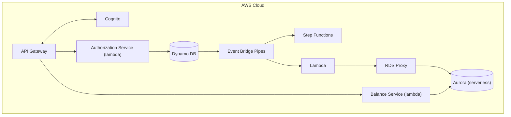

# Payledger System

## Overview

### Scope


## Objective

To build a card authorization and double-entry ledger system. This system should allow users to authorize
payments and manage their accounts by viewing their balance and their transaction history.

### Success Criteria

### Functional Requirements

- Users should be able to view their account's balance
- Users should be able to view their transaction history
- Users should be able to authorize payments 

### Non-Functional Requirements

- Maintain financial integrity by preventing double charges (Idempotency)
- The transaction history can have eventual consistency. However, reading balances must always
return the latest value.

### User Experience

The interaction is done only through the exposed rest endpoints. There will be no GUI or other modes
of interaction.

### Cloud Architecture



#### Data flow

**Authorizing payments**
1. A customer has $500 in their account.
2. Customer books a hotel room at $400
```
POST /authorizations
Idempotency-Key: 7c3a1e2f-...
{
  "account_id": "ACCT#123",
  "amount": 40000,        // cents
  "to_account_id": "ACCT#456",
  "expires_in_days": 7
}
```
3. Write `Authorization` record for $400 with pending status. `current_balance` stays $500 (no money has moved).
`available_balance` becomes $100 ($500 - $400 hold).
The customer's other card swipes will now only succeed if they're ≤ $100.
4. Capture the payment
```
POST /authorizations/{authId}/capture
{
  "amount": 40000
}
```
Update the authorization record status to captured. Write two new ledger entries (credit + debit). `current_balance` becomes $100
5. Alternative, the payment gets canceled.
```
POST /authorizations/{authId}/void
```
Update authorization record to voided.  `current_balance` stays $500, `available_balance` goes back to $500.

### Data Models

**Account**
- account_id (string)
- current_balance (int)
- available_balance (int)

**Authorization**
- authorization_id (string)
- account_id (string)
- to_account_id (string)
- status (enum PENDING, CAPTURED, POSTED, EXPIRED)
- amount (string)
- expires_in_days (int)
- created_at (string)

**Ledger Entry**
- transaction_id (int)
- account_id (str)
- source_authorization_id (str)
- amount (int)
- entry_type (enum DEBIT, CREDIT)

**Idempotency**
- idempotency_key (str)
- ttl 

### API

The API will consist of the following endpoints

| Method | Path | Notes |
|---|---|---|
| `POST` | `/authorizations` | Place a hold. Idempotent via `Idempotency-Key` header. |
| `POST` | `/authorizations/{id}/capture` | Convert hold to posted transaction. Supports partial capture. |
| `POST` | `/authorizations/{id}/void` | Release the hold. |
| `GET` | `/accounts/{id}/balance` | Returns both current and **available** balance. |
| `GET` | `/accounts/{id}/transactions` | Paginated history, cursor-based. |


## Design Decisions

### DynamoDB

We use DynamoDB as the database for the write path using a single table design. 

**Access patterns to satisfy:**

1. Get account by ID
2. Get authorization by ID
3. List authorizations for an account, newest first
4. List transactions for an account, by date range, paginated
5. Look up an idempotency record by key
6. Find expired holds for release

**Table design:**

| Entity | PK | SK | GSI1PK | GSI1SK |
|---|---|---|---|---|
| Account | `ACCT#<id>` | `META` | — | — |
| Authorization | `ACCT#<id>` | `AUTH#<ts>#<authId>` | `AUTH#<authId>` | `META` |
| Ledger entry | `ACCT#<id>` | `TXN#<ts>#<txnId>#<seq>` | `TXN#<txnId>` | `ENTRY#<seq>` |
| Idempotency | `IDEM#<key>` | `META` | — | — |

Notes:

- Sort keys are time-prefixed so range queries and reverse scans come free.
- GSI1 handles lookup-by-id when you don't know the account.
- Idempotency records get a **TTL** attribute (24–48h). Free cleanup.
- Expired-hold sweep: ea sparse GSI keyed on `expires_at` for holds only.
- Watch for hot partitions on high-volume accounts. Know what write sharding would look like even if you don't implement it.

**Updating the ledger**

When we capture an authorization we'll use DynamoDB `TransactWriteItems` to ensure that the ledger entries are created
and the account balance is properly updated

For example:

```
TransactWriteItems([

  // 1. Debit Alice's account balance
  Update {
    PK: "ACCT#alice", SK: "META",
    UpdateExpression: "SET current_balance = current_balance - :amt",
    ConditionExpression: "current_balance >= :amt",
    Values: { ":amt": 7500 }
  },

  // 2. Ledger entry: debit (money leaving Alice's account)
  Put {
    PK: "ACCT#alice",
    SK: "TXN#2026-07-30T10:05:00Z#txn-500#0",
    txnId: "txn-500",
    entryType: "DEBIT",
    amount: 7500,
    sourceAuthId: "auth-001"
  },

  // 3. Ledger entry: credit (money arriving in merchant payable)
  Put {
    PK: "MERCHANT#bobs-store",
    SK: "TXN#2026-07-30T10:05:00Z#txn-500#1",
    txnId: "txn-500",
    entryType: "CREDIT",
    amount: 7500,
    sourceAuthId: "auth-001"
  },

  // 4. Close the authorization, guarded against double-capture
  Update {
    PK: "ACCT#alice", SK: "AUTH#...#auth-001",
    UpdateExpression: "SET status = :captured",
    ConditionExpression: "status = :pending",
    Values: { ":captured": "CAPTURED", ":pending": "PENDING" }
  },

  // 5. Idempotency record
  Put {
    PK: "IDEM#<capture-idempotency-key>",
    SK: "META",
    responseSnapshot: {...},
    ttl: ...
  }
])
```

**Why not use a relational database?**

DynamoDB has several advantages over a relational database. It is serverless, can scale automatically and is highly 
available by default. DynamoDB also supports transactions which will help us ensure atomicity when dealing with 
financial transactions, ensuring data integrity. As we'll run on demand the initial costs will be much less that 
having an Aurora Cluster or an RDS cluster.

### Aurora Serverless

Aurora is used in serverless mode for the read path. We use a separate database as the access patterns are different
for the read path. As we'll be using lamdda we'll use RDS proxy to pool and share database connections.

## Implementation plan