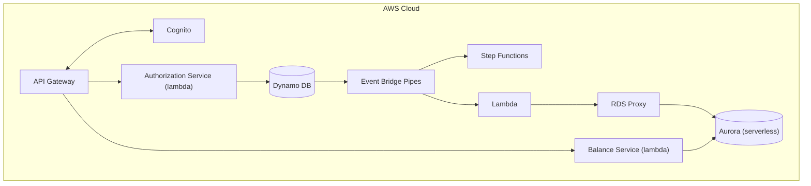

# Payledger System

## Overview

### Objective

To build a card authorization and double-entry ledger system. This system should allow users to authorize
payments and manage their accounts by viewing their balance and their transaction history.

### Scope

In scope: placing an authorization hold, capturing a hold (including partial capture) into a posted transaction,
voiding a hold, querying an account's current and available balance, and paginated transaction history.

Explicitly out of scope: multi-currency/FX, interest accrual, statement generation, and chargebacks/disputes. These
are deliberate exclusions, not omissions — they keep the invariant surface (hold lifecycle + double-entry balance)
tractable within the project's timeline.


### Success Criteria

The system is considered correct if the following invariants hold under all conditions, including concurrent
requests and randomized/adversarial input:

1. For every transaction, the sum of all ledger entries equals zero.
2. `available_balance = current_balance - sum(active_holds)`, at all times.
3. An authorization can be captured at most once, for at most its authorized amount.
4. Replaying a request with the same idempotency key returns the original response, never a second effect.
5. Expired holds (default 7 days) release automatically, without manual intervention.

### Functional Requirements

- Users should be able to view their account's balance
- Users should be able to view their transaction history
- Users should be able to authorize payments 

### Non-Functional Requirements

- Maintain financial integrity by preventing double charges (Idempotency)
- The transaction history can have eventual consistency. However, reading balances must always
return the latest value.

### User Experience

The interaction is done only through the exposed rest endpoints. There will be no GUI or other modes
of interaction.

### Cloud Architecture



#### Data flow

**Authorizing payments**
1. A customer has $500 in their account.
2. Customer books a hotel room at $400
```
POST /authorizations
Idempotency-Key: 7c3a1e2f-...
{
  "account_id": "ACCT#123",
  "amount": 40000,        // cents
  "to_account_id": "ACCT#456",
  "expires_in_days": 7
}
```
3. Write `Authorization` record for $400 with pending status. `current_balance` stays $500 (no money has moved).
`available_balance` becomes $100 ($500 - $400 hold).
The customer's other card swipes will now only succeed if they're ≤ $100.
4. Capture the payment
```
POST /authorizations/{authId}/capture
{
  "amount": 40000
}
```
Update the authorization record status to captured. Write two new ledger entries (credit + debit). `current_balance` becomes $100
5. Alternative, the payment gets canceled.
```
POST /authorizations/{authId}/void
```
Update authorization record to voided.  `current_balance` stays $500, `available_balance` goes back to $500.

### Data Models

**Account**
- account_id (string)
- current_balance (int)
- available_balance (int)

**Authorization**
- authorization_id (string)
- account_id (string)
- to_account_id (string)
- status (enum PENDING, CAPTURED, POSTED, EXPIRED)
- amount (string)
- expires_in_days (int)
- created_at (string)

**Ledger Entry**
- transaction_id (int)
- account_id (str)
- source_authorization_id (str)
- amount (int)
- entry_type (enum DEBIT, CREDIT)

**Idempotency**
- idempotency_key (str)
- ttl 

### API

The API will consist of the following endpoints

| Method | Path | Notes |
|---|---|---|
| `POST` | `/authorizations` | Place a hold. Idempotent via `Idempotency-Key` header. |
| `POST` | `/authorizations/{id}/capture` | Convert hold to posted transaction. Supports partial capture. |
| `POST` | `/authorizations/{id}/void` | Release the hold. |
| `GET` | `/accounts/{id}/balance` | Returns both current and **available** balance. |
| `GET` | `/accounts/{id}/transactions` | Paginated history, cursor-based. |


## Design Decisions

### DynamoDB

We use DynamoDB as the database for the write path using a single table design. 

**Access patterns to satisfy:**

1. Get account by ID
2. Get authorization by ID
3. List authorizations for an account, newest first
4. List transactions for an account, by date range, paginated
5. Look up an idempotency record by key
6. Find expired holds for release

**Table design:**

| Entity | PK | SK | GSI1PK | GSI1SK |
|---|---|---|---|---|
| Account | `ACCT#<id>` | `META` | — | — |
| Authorization | `ACCT#<id>` | `AUTH#<ts>#<authId>` | `AUTH#<authId>` | `META` |
| Ledger entry | `ACCT#<id>` | `TXN#<ts>#<txnId>#<seq>` | `TXN#<txnId>` | `ENTRY#<seq>` |
| Idempotency | `IDEM#<key>` | `META` | — | — |

Notes:

- Sort keys are time-prefixed so range queries and reverse scans come free.
- GSI1 handles lookup-by-id when you don't know the account.
- Idempotency records get a **TTL** attribute (24–48h). Free cleanup.
- Expired-hold sweep: ea sparse GSI keyed on `expires_at` for holds only.
- Watch for hot partitions on high-volume accounts. Know what write sharding would look like even if you don't implement it.

**Updating the ledger**

When we capture an authorization we'll use DynamoDB `TransactWriteItems` to ensure that the ledger entries are created
and the account balance is properly updated

For example:

```
TransactWriteItems([

  // 1. Debit Alice's account balance
  Update {
    PK: "ACCT#alice", SK: "META",
    UpdateExpression: "SET current_balance = current_balance - :amt",
    ConditionExpression: "current_balance >= :amt",
    Values: { ":amt": 7500 }
  },

  // 2. Ledger entry: debit (money leaving Alice's account)
  Put {
    PK: "ACCT#alice",
    SK: "TXN#2026-07-30T10:05:00Z#txn-500#0",
    txnId: "txn-500",
    entryType: "DEBIT",
    amount: 7500,
    sourceAuthId: "auth-001"
  },

  // 3. Ledger entry: credit (money arriving in merchant payable)
  Put {
    PK: "MERCHANT#bobs-store",
    SK: "TXN#2026-07-30T10:05:00Z#txn-500#1",
    txnId: "txn-500",
    entryType: "CREDIT",
    amount: 7500,
    sourceAuthId: "auth-001"
  },

  // 4. Close the authorization, guarded against double-capture
  Update {
    PK: "ACCT#alice", SK: "AUTH#...#auth-001",
    UpdateExpression: "SET status = :captured",
    ConditionExpression: "status = :pending",
    Values: { ":captured": "CAPTURED", ":pending": "PENDING" }
  },

  // 5. Idempotency record
  Put {
    PK: "IDEM#<capture-idempotency-key>",
    SK: "META",
    responseSnapshot: {...},
    ttl: ...
  }
])
```

**Why not use a relational database?**

DynamoDB has several advantages over a relational database. It is serverless, can scale automatically and is highly 
available by default. DynamoDB also supports transactions which will help us ensure atomicity when dealing with 
financial transactions, ensuring data integrity. As we'll run on demand the initial costs will be much less that 
having an Aurora Cluster or an RDS cluster.

### Aurora Serverless

Aurora is used in serverless mode for the read path. We use a separate database as the access patterns are different
for the read path. As we'll be using lambda we'll use RDS proxy to pool and share database connections.

**Why a second database at all?**

DynamoDB is built to satisfy the fixed, known-in-advance access patterns above — it is structurally unable to answer
ad hoc questions: aggregations, joins, arbitrary date-range scans, "top merchants by spend last quarter." Aurora
Postgres exists purely to serve that class of query. This gives the system two databases with two different jobs
rather than one database stretched past its access-pattern fit: DynamoDB is the source of truth for the write path,
Aurora is a derived, disposable read model. If Aurora were lost entirely, it could be rebuilt from DynamoDB.

**How data gets there**

```
DynamoDB Streams → Lambda projector → Aurora Serverless v2 (via RDS Proxy)
```

A Lambda projector consumes the DynamoDB stream and writes into Aurora using `psycopg` (v3). This is the CQRS
pattern: DynamoDB owns writes, Aurora is eventually consistent and exists only to serve reads that need SQL. Because
streams deliver **at-least-once**, the projector must be idempotent — each record carries a monotonic sequence
number, and the projector upserts using that sequence to discard replays rather than double-apply them. Because the
projection is derived, it must also support a full **rebuild from scratch** (replaying the table from a DynamoDB
export) if the projector logic changes or the read model needs to be repaired.

**Why RDS Proxy**

Lambda invocations scale out independently and can burst to hundreds of concurrent executions; each one opening its
own Postgres connection will exhaust Aurora's connection limit long before it exhausts CPU or ACU capacity. RDS
Proxy sits in front of Aurora and pools/multiplexes connections so bursty, concurrent Lambda invocations don't take
the database down. Connecting Lambda straight to Postgres is the failure mode to design around deliberately, not
discover in production.

**Cost posture**

Aurora Serverless v2 is configured with **minimum capacity of 0 ACUs**, so it scales to zero and stops billing
compute when idle. This only works if nothing keeps a connection open — a stray RDS Proxy connection or a forgotten
debugging session will keep it warm indefinitely. Aurora is provisioned only once the write path and projector are
in place, not from day one.

## Architecture Decision Records

Each ADR states the decision, the alternative rejected, the reasoning, and the condition under which it would be
revisited.

### ADR-1: DynamoDB over Aurora for the write path

**Decision:** The write path (accounts, authorizations, ledger entries, idempotency records) is DynamoDB, not
Aurora/Postgres.

**Rejected:** Aurora as the single database for both writes and reads.

**Rationale:** The write path's access patterns are fixed and known in advance (get by ID, list by account, look up
idempotency key) — exactly what a single-table DynamoDB design is built for. `TransactWriteItems` gives atomic,
conditional multi-item writes, which is what's needed to move a hold and write ledger entries together. DynamoDB is
also serverless with true scale-to-zero economics on-demand, whereas an always-on Aurora writer has a floor cost
even when idle.

**Revisit when:** the write path needs ad hoc queries, multi-row joins, or strong relational constraints that
outgrow what a handful of fixed access patterns can express — at that point the operational cost of running
Aurora as the primary store may be worth it.

### ADR-2: Step Functions orchestration over pure event choreography

**Decision:** The capture saga (fraud screen → settlement submission → notification) is orchestrated with Step
Functions Express workflows, with explicit compensating transactions on failure.

**Rejected:** Pure choreography — each service reacting to the previous service's event with no central
coordinator.

**Rationale:** A multi-step financial saga needs a single place that knows the full sequence, can time out, and can
run reversal logic when a downstream step fails. Choreography spreads that knowledge across every consumer, making
"what state is this capture actually in?" hard to answer and hard to debug during an incident. Step Functions Express
is cheap at this volume and gives a visual, inspectable execution history for free — valuable when the answer to "why
did this transaction not settle" needs to be found quickly.

**Revisit when:** the number of independently-scaling, loosely-coupled consumers grows large enough that a central
orchestrator becomes a bottleneck or a single point of coordination failure — at that point event choreography (or a
mix, with orchestration only for the compensating-transaction-critical steps) is worth reconsidering.

### ADR-3: Provisioned concurrency / SnapStart over accepting cold starts

**Decision:** Latency-sensitive Lambdas (the synchronous write path: authorize/capture/void, balance reads) use
either provisioned concurrency or SnapStart rather than accepting on-demand cold starts.

**Rejected:** Accepting cold starts as-is, relying only on Lambda's default warm-pool behavior.

**Rationale:** Card authorization is a synchronous, user-facing call — a multi-second cold start on `POST
/authorizations` is a bad customer experience and, at the margin, a lost sale (the same pressure card networks
apply with their own timeout budgets). SnapStart (Python support as of late 2024) and provisioned concurrency both
remove that tail at different cost/complexity trade-offs, worth measuring against each other under load rather than
assumed.

**Revisit when:** traffic is high and steady enough that the Lambda stays warm on its own, or cost pressure makes the
provisioned-concurrency/SnapStart overhead not worth a tail-latency improvement nobody is measuring.

### ADR-4: Single-table over multi-table DynamoDB design

**Decision:** Accounts, authorizations, ledger entries, and idempotency records all live in one DynamoDB table,
distinguished by key prefix, per the table design above.

**Rejected:** A separate table per entity type.

**Rationale:** The core write operation — capture — must atomically touch the account balance, ledger entries, the
authorization status, and the idempotency record in one `TransactWriteItems` call. DynamoDB transactions are
constrained more easily (and cheaply) within a single table, and a single table also means one set of
capacity/throughput knobs to reason about instead of several. The access-pattern list was enumerated up front
specifically to make this single-table design tractable.

**Revisit when:** an entity's access patterns diverge so far from the others (radically different read/write
volume, different scaling or backup requirements) that sharing a table creates more operational coupling than the
transactional convenience is worth.

### ADR-5: Reversal entries over mutable ledger records

**Decision:** Correcting a posted transaction (e.g. a failed settlement after capture) is done by writing new,
opposite-sign ledger entries — never by updating or deleting the original entries.

**Rejected:** Mutating or deleting the original ledger entry to "fix" it.

**Rationale:** The core invariant is that every transaction's entries sum to zero and the ledger is an append-only,
auditable record — a requirement that comes directly from the domain, not a technical preference. A mutated ledger
is no longer a trustworthy audit trail: it can't answer "what did the balance look like at 3pm yesterday" or survive
a dispute investigation. A reversal is itself a balanced transaction, so the zero-sum invariant holds through
corrections, not just through the happy path.

**Revisit when:** never, for posted entries — this is a hard invariant of the domain, not a scoping choice. (Ledger
entries for an authorization that is still `PENDING`, i.e. a hold with no posted movement, are not in scope of this
rule.)

### ADR-6: EventBridge over direct SQS fan-out

**Decision:** DynamoDB Streams feed EventBridge, which fans out to Step Functions and to the Aurora projector,
rather than the stream feeding SQS queues directly.

**Rejected:** Direct SQS fan-out from the stream consumer to each downstream consumer.

**Rationale:** EventBridge decouples "an event happened" from "who currently cares about it" — new consumers (a
second projector, a fraud-analytics stream) can subscribe via a rule without touching the producer or existing
consumers, and schema/versioning is centralized at the bus rather than duplicated per queue. SQS still sits between
EventBridge and each individual consumer for buffering, retry, and DLQ semantics — EventBridge and SQS are
complementary here, not a replacement for one another.

**Revisit when:** the event volume is high enough, or the fan-out pattern static enough, that EventBridge's
per-event cost and added hop stop being worth the routing flexibility — a fixed, small number of consumers may be
simpler and cheaper wired directly to SQS.

## Cost Model

This estimates steady-state production cost at **100 TPS sustained, 24/7** — a capacity-planning exercise, distinct
from the cost of *building* the project (see Development cost below).

### Assumptions

- 100 TPS blended average → 100 × 2,592,000s ≈ **259.2M requests/month**.
- Traffic split: ~30 TPS write path (`authorize`/`capture`/`void`), ~70 TPS read path (`balance`/`transactions`).
- Of the write traffic, only `capture` runs the full saga and writes ledger entries; `authorize`/`void` are lighter
  DynamoDB operations. Figures below are order-of-magnitude, not a quote — the point is to reason about the shape
  of the bill, not to be precise to the dollar.

### Cost by component (monthly, us-east-1 list pricing)

| Component | Est. monthly cost | Driver |
|---|---|---|
| API Gateway (REST) | ~$910 | $3.50 / million requests × 259.2M |
| Lambda (sync handlers) | ~$490 | $0.20/M invocations + GB-s compute at ~512MB / ~200ms |
| DynamoDB (on-demand) | ~$1,000 | `TransactWriteItems` on every capture bills each item at **2× normal WCU** |
| DynamoDB Streams | ~$0 | Included in Lambda's stream-polling cost |
| EventBridge | ~$80 | $1/M events published, capture flow only |
| Step Functions (Express) | ~$100 | $1/M executions + state-transition duration |
| SQS | ~$20 | $0.40/M requests, DLQ included |
| Aurora Serverless v2 + RDS Proxy | ~$300 | ~2 ACU sustained average — at this volume it does **not** scale to zero |
| CloudWatch Logs + X-Ray | ~$150 | 7-day retention, 5–10% X-Ray sampling |
| NAT Gateway | $0 | Avoided by design — gateway VPC endpoint for DynamoDB instead |
| **Total** | **~$3,050/month** | |

### Where the cliff is

The bill is roughly linear in traffic *except* in two places:

- **Aurora ACU scaling.** Aurora Serverless v2 scales smoothly up to its configured max, but if sustained load
  pushes past that ceiling, query latency degrades before cost visibly jumps — the "cliff" is a latency cliff before
  it's a cost cliff, and it's easy to miss until the projector falls behind or reads start timing out.
- **Provisioned concurrency / SnapStart** (ADR-3). If cold-start mitigation is added on the write path, provisioned
  concurrency is billed **per hour regardless of traffic**, not per invocation — at low-to-moderate sustained
  traffic this can flip Lambda from a variable cost to a cost floor that doesn't shrink even if TPS drops.

### Dominant line item and the lever

**DynamoDB and API Gateway dominate**, at roughly $1,000 and $900/month respectively, with Lambda close behind.

- **DynamoDB's** cost is driven almost entirely by `TransactWriteItems` on capture — 5 items per transaction, each
  billed at double the standalone WCU rate. The lever: reduce items-per-transaction where possible, or — if traffic
  is steady and predictable rather than bursty — move to **provisioned capacity with auto-scaling**, which is
  roughly 5–7× cheaper per request unit than on-demand at steady volume. On-demand is the right choice for this
  project's spiky, low-volume dev/test usage; it stops being the right choice once traffic is this steady.
- **API Gateway's** cost is a near-fixed $3.50/million regardless of payload or logic. The lever: migrating from
  REST API to **HTTP API** (API Gateway v2) cuts this to $1.00/million — roughly a 70% reduction — at the cost of
  losing REST-only features (request validators, usage plans) that would need to move into the Lambda layer.

### Development cost (this project, 3 weeks)

Building and testing this system is a separate, much smaller budget line — per the project plan's cost guardrails:
target **$10–30 total**, enforced via a day-one AWS Budget alarm, DynamoDB on-demand, no NAT Gateway, Aurora min
capacity set to 0 ACUs (and verified to actually pause), 7-day CloudWatch log retention, and `terraform destroy` at
the end of each day in week 3 when not actively testing.


## Implementation plan

### Week 1 — Core correctness

- Domain model with **Pydantic**: `Account`, `Authorization`, `LedgerEntry`, `Money` (Decimal-backed, never float).
- Finalize the single-table design against the access-pattern list above.
- Idempotency layer — start with Powertools' decorator, then read its source to understand the conditional-write mechanics.
- Terraform modules + CI pipeline running on day 2, not day 10.
- Integration tests against **DynamoDB Local via Testcontainers** (the `testcontainers-python` package).
- **A property-based test with Hypothesis asserting the ledger always balances** after any random sequence of valid operations. This one test is worth more than fifty unit tests and it's a great thing to point at in conversation.

*Exit criteria: authorize / capture / void work end to end, idempotently, with the balance invariant verified under randomized input.*

### Week 2 — Distributed systems

- DynamoDB Streams → EventBridge, with a versioned event schema (Pydantic models doubling as the schema definition).
- Step Functions capture saga with real compensating transactions.
- Aurora Serverless v2 + the stream projector, connecting through RDS Proxy. **Create Aurora now, not in week 1.**
- Observability: CloudWatch dashboard, alarms on DLQ depth and p99 latency, X-Ray traces that show a full request path across async boundaries.

*Exit criteria: a capture flows through the saga, lands in Aurora, and you can trace one request end to end in X-Ray.*

### Week 3

- **Break it on purpose.** Kill a Lambda mid-saga. Throttle DynamoDB. Poison the queue. Force a `TransactionCanceledException`. Fix what breaks.
- Build a **DLQ replay tool** — a small CLI (Python + boto3) that inspects, edits, and re-drives failed messages.
- Load test with **k6**: watch cold starts (with and without provisioned concurrency — note SnapStart now supports Python as of late 2024, worth trying), throttling behavior, projection lag under sustained write pressure.
- Write everything up (section 5).

*Exit criteria: you can describe three failure modes you induced, what the system did, and what you changed.*
