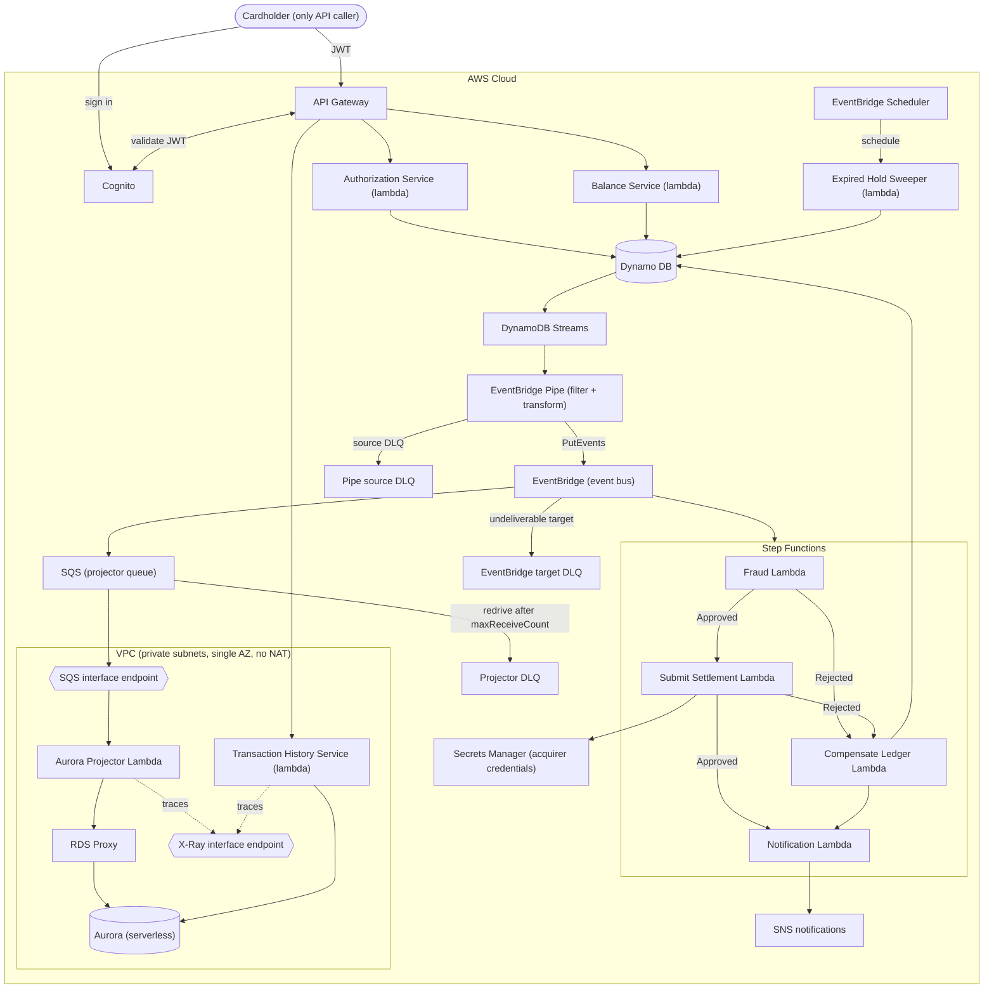

# Payledger System

## Overview

### Objective

To build a card authorization and double-entry ledger system. This system should allow users to authorize
payments and manage their accounts by viewing their balance and their transaction history.

### Scope

In scope: placing an authorization hold, capturing a hold into a posted transaction, voiding a hold, querying an
account's current and available balance, and paginated transaction history.

Explicitly out of scope: multi-currency/FX, interest accrual, statement generation, chargebacks/disputes, and
**partial capture** — a capture is all-or-nothing for the full authorized amount. These
are deliberate exclusions, not omissions — they keep the invariant surface (hold lifecycle + double-entry balance)
tractable within the project's timeline.


### Success Criteria

The system is considered correct if the following invariants hold under all conditions, including concurrent
requests and randomized/adversarial input:

1. For every transaction, the sum of all ledger entries equals zero.
2. `available_balance = current_balance - sum(active_holds)`, at all times.
3. An authorization can be captured at most once, for exactly its authorized amount.
4. Replaying a request with the same idempotency key returns the original response, never a second effect. The one
   exception is a capture the saga later reverses: compensation invalidates the idempotency record, so a replay
   re-executes and fails the `PENDING` guard rather than returning a stale success.
5. Expired holds (default 7 days) release automatically, without manual intervention.

### Functional Requirements

- Users should be able to view their account's balance
- Users should be able to view their transaction history
- Users should be able to authorize payments 

### Non-Functional Requirements

- Maintain financial integrity by preventing double charges (Idempotency)
- The transaction history can have eventual consistency. However, reading balances must always
return the latest value.

### User Experience

The interaction is done only through the exposed rest endpoints. There will be no GUI or other modes
of interaction.

### Cloud Architecture



Balance reads go to DynamoDB with a strongly-consistent `GetItem`, not to Aurora — the non-functional requirement
says balance must always return the latest value, and Aurora is by construction an eventually-consistent derived
model. Transaction history goes to Aurora, where eventual consistency is acceptable.

#### Data flow

**Authorizing payments**
1. A customer has $500 in their account.
2. Customer books a hotel room at $400
```
POST /authorizations
Authorization: Bearer <jwt>          // sub → account_id
Idempotency-Key: 7c3a1e2f-...
{
  "amount": 40000,        // cents
  "merchant_id": "mrch_456",
  "expires_in_days": 7
}
```
3. Write `Authorization` record for $400 with pending status. `current_balance` stays $500 (no money has moved).
`available_balance` becomes $100 ($500 - $400 hold).
The customer's other card swipes will now only succeed if they're ≤ $100.
4. Capture the payment. The capture takes no body — it is always for the full authorized amount.
```
POST /authorizations/{authId}/capture
Idempotency-Key: 9f2b4d1c-...
```
Update the authorization record status to captured. Write two new ledger entries (debit the account, credit the
merchant). `current_balance` becomes $100. `available_balance` stays $100 — the hold is released at the same moment
the money leaves, so the two changes cancel out.
5. Alternative, the payment gets canceled.
```
POST /authorizations/{authId}/void
Idempotency-Key: 3e8a7b5d-...
```
Update authorization record to voided. `current_balance` stays $500, `available_balance` goes back to $500.
6. Alternative, the capture is reversed by the saga (fraud flagged, or settlement permanently failed). Write a
balanced REVERSAL transaction, restore `current_balance` to $500 and `available_balance` to $500, and move the
authorization to `REVERSED`. The original ledger entries are never touched.

### Data Models

All monetary amounts are integer **minor units (cents)**. No floats anywhere; `Decimal` is used only at the
presentation boundary if a decimal representation is ever needed.

**Account**
- account_id (str)
- current_balance (int)
- available_balance (int)

`available_balance` is materialized rather than derived so that a balance read is a single `GetItem` instead of a
query summing every active hold. The cost of that choice is that it must be maintained transactionally by every
operation that touches a hold — authorize, capture, void, expiry, reversal — and the sufficient-funds
`ConditionExpression` guards it at **authorize** time, which is the only moment the check is meaningful. Invariant 2
therefore becomes an assertion to test against (the property-based test recomputes it from the holds), not the
mechanism by which the value is produced.

**Merchant**
- merchant_id (str)
- name (str)
- payable_balance (int) — the merchant's side of the ledger; credited on capture, debited on reversal
- created_at (str) — ISO-8601 UTC

Merchants are the counterparty on every transaction. They are a distinct entity rather than a kind of account: they
have no holds, no available balance, and no authorization lifecycle, so folding them into `Account` would mean an
entity where half the fields are permanently unused.

**Merchants are created through the API, with a client-supplied id.** `POST /merchants` takes the `merchant_id`
from the caller rather than generating one, and writes the item under `ConditionExpression:
attribute_not_exists(PK)`. That single choice settles three things at once, which is the reason for it:

- **It is the idempotency mechanism.** The natural key *is* the key, so a retried create is a no-op that returns
  `409 MerchantAlreadyExists` instead of quietly producing a second merchant. This is the one `POST` in the API
  that does not require an `Idempotency-Key` header, and it is exempt because it does not need one — see the
  error-response contract.
- **It is the safety mechanism, and this is the load-bearing part.** An unconditional `PutItem` against an existing
  `merchant_id` would overwrite the item and **reset a live `payable_balance` to `0` from a public endpoint** — a
  silent, unrecoverable corruption of a value the ledger considers authoritative. The condition is what makes
  creation non-destructive. Treat it as an invariant with a test behind it, not as an implementation detail of the
  handler.
- **It keeps merchant ids caller-chosen**, which matches how `POST /authorizations` already treats them: the client
  sends an id it knows, and the service validates it. The id is still an external identifier — the handler applies
  the `MERCHANT#` prefix, and a caller that sends one gets a 400 rather than a nested key.

Two further consequences worth stating rather than discovering:

- `POST /authorizations` carries a client-supplied `merchant_id`, so the Authorization Service must **`GetItem` the
  merchant and reject an unknown id with a 400** before placing the hold. Without that check a typo produces a
  perfectly balanced transaction against a merchant that does not exist, and the ledger invariant will not catch it
  — both sides sum to zero regardless. The set of valid ids is open and grows at runtime, so this check is the
  only thing standing between a typo and a transaction against a merchant nobody created.
- **Merchants can be created but never deleted.** Every role carries an explicit `Deny` on `dynamodb:DeleteItem`
  (see Security → IAM), and no exception is possible for `MERCHANT#*` — a merchant's identity item shares a
  partition with its ledger entries, and IAM cannot tell them apart. There is therefore no `DELETE /merchants/{id}`
  and there cannot be one. Retiring a merchant would be an `UpdateItem` on a status flag; that is not built.

`payable_balance` is created at `0` and thereafter only ever moved by capture and reversal. Nothing else writes it,
including the create endpoint, which cannot run twice against the same id.

**Authorization**
- authorization_id (str)
- account_id (str)
- merchant_id (str)
- status (enum PENDING, CAPTURED, VOIDED, EXPIRED, REVERSED)
- amount (int) — the authorized amount; a capture is always for exactly this amount
- expires_at (str) — ISO-8601 UTC; the attribute the sparse expiry GSI is keyed on
- created_at (str) — ISO-8601 UTC
- updated_at (str) — ISO-8601 UTC

`expires_in_days` is a *request* field only. It is resolved to an absolute `expires_at` at write time, because the
expiry sweep needs an absolute value to range-query against.

Because partial capture is out of scope, there is no `captured_amount` and no `PARTIALLY_CAPTURED` status: the
`PENDING → CAPTURED` transition guarded by a `ConditionExpression` is the whole of invariant 3's enforcement.

**Ledger Entry**
- transaction_id (str)
- party_id (str) — the account or merchant this entry belongs to
- party_type (enum ACCOUNT, MERCHANT)
- source_authorization_id (str)
- amount (int)
- entry_type (enum DEBIT, CREDIT)
- created_at (str) — ISO-8601 UTC, matches the timestamp embedded in the sort key

An entry belongs to a *party*, not specifically an account, because the credit side of every transaction lands on a
merchant. `party_type` mirrors the key prefix (`ACCT#` / `MERCHANT#`) so an entry can be resolved back to its owner
without a second lookup.

**Idempotency**
- idempotency_key (str)
- request_hash (str) — hash of the request body; a replay with the same key but a different payload is a 422, not a
  silent replay of the original response
- status (enum IN_PROGRESS, COMPLETED) — lets a retry distinguish "still running" from "done", which is what makes
  the crash-after-write-before-response case recoverable
- response_snapshot (json) — the original response, returned verbatim on replay
- ttl (int) — epoch seconds, 24–48h

Saga compensation **deletes** the idempotency record for a capture it reverses. Returning the stored success
snapshot after the money has been reversed would be a lie about current state; deleting it means a replay
re-executes the capture, hits the `PENDING` guard against a now-`REVERSED` authorization, and returns a terminal
error instead.

### API

The API will consist of the following endpoints

| Method | Path | Notes |
|---|---|---|
| `POST` | `/merchants` | Create a merchant with a client-supplied `merchant_id`. Idempotent via a conditional write, not via a header. |
| `POST` | `/authorizations` | Place a hold. Idempotent via `Idempotency-Key` header. |
| `POST` | `/authorizations/{id}/capture` | Convert hold to posted transaction, for the full authorized amount. No body. Idempotent via `Idempotency-Key`. |
| `POST` | `/authorizations/{id}/void` | Release the hold. Idempotent via `Idempotency-Key`. |
| `GET` | `/accounts/me/balance` | Returns both current and **available** balance. Served from DynamoDB, strongly consistent. |
| `GET` | `/accounts/me/transactions` | Paginated history, cursor-based. Served from Aurora, eventually consistent. |

Account, merchant, and authorization identifiers are opaque strings in the public API. The `ACCT#` / `MERCHANT#` /
`AUTH#` prefixes in the table design below are an internal key encoding and are never exposed to or accepted from
clients.

Account-scoped routes are addressed as `me`, not by account id, and `POST /authorizations` carries no `account_id`
field: the account is always derived from the caller's validated `sub` claim. See Security → Authorization for why
this is a shape rather than a validation rule.

**`POST /merchants` is the one route that is not account-scoped, and that is worth being precise about.** Any
authenticated cardholder can call it, and the created merchant belongs to nobody — there is no owner field, no
`account_id` on the item, and no ownership check on any subsequent read of it. This does not weaken the ownership
rule for everything else: `account_id == sub` still holds wherever an account is involved, because a merchant is
not an account and is never addressed relative to the caller.

What it does mean is that "the shape of the API is the enforcement mechanism" is a statement about the
*account-scoped* routes, not about every route. Merchants sit outside that model deliberately — they are shared
reference data in a system whose only caller class is the cardholder (ADR-7), and giving them an owner would
require inventing a merchant-administrator role that has nobody to be. Stated plainly: authentication is the only
gate on merchant creation, there is no authorization step beyond it, and on a real deployment this is the first
route that would need a caller class of its own.

`POST /merchants` and `POST /authorizations` are the only two places the API accepts an identifier it did not
derive from the token. In both cases the identifier names a merchant, and in both cases the handler is responsible
for the check — `attribute_not_exists` on create, `GetItem` on use.

**There is no `GET /merchants`.** A caller knows the id it chose, so listing is not needed to use the API, and
adding it would cost either a table scan or a GSI on a constant partition key — merchant items share no partition,
so there is no cheap way to enumerate them (see DynamoDB, access patterns). Discovery across callers is therefore
out of band, which is a real limitation and an accepted one at this scope.

### Error-response contract

Success is uninteresting and short: `201` for `POST /authorizations`, `200` for capture, void, balance, and
transactions. Everything below is about the failures, because in a payments API the failure codes are the part
clients actually build logic against — "was this rejected forever, or should I retry?" has to be answerable from the
response alone.

**Envelope.** Every error the service itself generates has one shape, the one `shared/utils.error_response` already
emits:

```json
{ "error": "InsufficientFunds", "message": "available balance is lower than the requested amount" }
```

`error` is a stable machine-readable code and is part of the contract; `message` is human-readable, may change at
any time, and must never be parsed. Clients branch on `error`, not on the status code alone — `409` covers six
distinct conditions with six different remedies. Correlation to logs is the `x-amzn-RequestId` response header
rather than a body field, which keeps request-scoped internals out of a body the caller keeps.

Two failures cannot use this envelope because they are produced before the handler runs: the Cognito authorizer's
`401` (`{"message":"Unauthorized"}`) and API Gateway's throttling `429`. API Gateway *Gateway Responses* can be
remapped in Terraform to restore uniformity; that is deliberately not done, since the cost is a body template per
response type and the benefit is cosmetic for the one caller class this API has.

**The catalogue.**

| Status | `error` | Condition | Retry? |
|---|---|---|---|
| 400 | `InvalidRequest` | Body is not JSON, a required field is missing or ill-typed, `amount` ≤ 0, `expires_in_days` out of range, or the body carries an `account_id` (see Security → Authorization) | Not as sent |
| 400 | `UnknownMerchant` | `merchant_id` on an authorization names a merchant that does not exist | Not as sent |
| 400 | `MissingIdempotencyKey` | No `Idempotency-Key` header on `POST /authorizations`, capture, or void | Not as sent |
| 400 | `InvalidCursor` | `GET /accounts/me/transactions` cursor is unreadable or expired | Not as sent |
| 404 | `AuthorizationNotFound` | Unknown authorization id, **or** one owned by another account | No |
| 409 | `MerchantAlreadyExists` | `POST /merchants` with a `merchant_id` that is already taken | No |
| 409 | `InsufficientFunds` | `available_balance < amount` at authorize time | After a deposit |
| 409 | `AlreadyCaptured` | Capture or void against a `CAPTURED` authorization | No |
| 409 | `AlreadyVoided` | Capture or void against a `VOIDED` authorization | No |
| 409 | `AuthorizationExpired` | Capture or void against an `EXPIRED` authorization | No |
| 409 | `AuthorizationReversed` | Capture or void against a `REVERSED` authorization (the saga compensated) | No |
| 409 | `RequestInFlight` | The idempotency record exists with status `IN_PROGRESS` — the original request is still running | Yes, with `Retry-After: 1` |
| 422 | `IdempotencyKeyReuse` | Same `Idempotency-Key`, different request body | No |
| 429 | *(gateway shape)* | API Gateway throttling | Yes, honour `Retry-After` |
| 500 | `InternalServerError` | Anything unhandled. Body is the bare code and a fixed message; exception text never reaches the caller | Unsafe without a new key |
| 503 | `ServiceUnavailable` | DynamoDB transaction contention or a dependency failure that survived the SDK's retries | Yes, with `Retry-After` |

`404` for an authorization owned by someone else is not a slip: a `403` there confirms the id exists and turns the
endpoint into an oracle for enumerating other users' authorization ids. The reasoning is in Security →
Authorization; it is restated here because this table is where someone will look for it.

**Why insufficient funds is a `409` and not a `402`.** `402 Payment Required` reads as the obvious choice and is
wrong for this API: RFC 9110 still marks it reserved, and the proxies and API clients that do assign it meaning read
it as *payment required to use the API*, not *this payment failed*. `409` says what is actually true — the request
conflicts with the current state of the account, and the same bytes sent after a deposit succeed. That is precisely
the `409` / `422` split used throughout the table: **`409` means the request is well-formed and would succeed
against a different resource state; `422` means the request is understood and will never succeed as written.**
Idempotency-key reuse is the only genuine `422` here, because no change in account or authorization state makes a
key that is already bound to a different payload usable again.

`MerchantAlreadyExists` sits on the correct side of that split: the same bytes sent while the id was still free
would have succeeded, so it is a state conflict rather than a permanently invalid request.

**Idempotency outcomes.** The `Idempotency-Key` header is required on the three `POST` routes that move money —
authorize, capture, void. `POST /merchants` is deliberately outside this machinery: its client-supplied id is
already a natural idempotency key, and a conditional write on it gives the same guarantee without an idempotency
record, a request hash, or a stored snapshot to expire. A retry gets `409 MerchantAlreadyExists` rather than a
replayed `201`, which is a weaker contract than the money routes get — the caller cannot distinguish "you created
this a moment ago" from "someone else took this id" — and that is acceptable only because merchant creation is not
a financial operation. Given a key, a request hash, and the stored record, there are exactly four outcomes:

| Stored record | Hash | Response |
|---|---|---|
| Absent | — | Execute; store `COMPLETED` with the response snapshot |
| `COMPLETED` | Matches | Replay the snapshot verbatim, original status code included |
| `COMPLETED` | Differs | `422 IdempotencyKeyReuse` |
| `IN_PROGRESS` | Either | `409 RequestInFlight`, `Retry-After: 1` |

Idempotency is keyed on the header, not on the operation, so a *new* key against an already-terminal authorization
is a real request that fails the state guard: voiding a `VOIDED` authorization under a fresh key is `409
AlreadyVoided`, not a courtesy `200`. Only a replay of the original key replays the original response. And per
invariant 4, a capture the saga later reversed has had its idempotency record deleted — replaying that key
re-executes the capture, which then fails the `PENDING` guard and returns `409 AuthorizationReversed`. A client that
treated its stored `200` as final learns the truth on retry rather than never.

**Deriving the code from a `TransactionCanceledException`.** The mapping above is only implementable if
`CancellationReasons` is read **positionally** — the array has one entry per transaction item, in the order the
items were submitted, and only the entries with `ConditionalCheckFailed` matter. For the authorize transaction:

| Failed item | Meaning | Response |
|---|---|---|
| 1 (`ACCT#…` balance) | `available_balance >= :amt` failed | `409 InsufficientFunds` |
| 2 (`AUTH#…` put) | Authorization id collision — a generated-id bug, not a client error | `500` |
| 3 (`IDEM#…` put) | Key already exists | Re-read the record and apply the idempotency table above |

Conflating items 1 and 3 is the easy bug and produces the worst possible failure mode: a client told "insufficient
funds" for what was actually a successful retry. For the capture transaction, item 5 is the `PENDING` guard, and a
failure there means the authorization is in *some* terminal state — the handler then does a single `GetItem` to
read which one and picks between `AlreadyCaptured`, `AlreadyVoided`, `AuthorizationExpired`, and
`AuthorizationReversed`. That extra read happens only on the error path, where an extra RCU is free compared to
returning a code that does not say what went wrong.

**The expiry window is real and is accepted.** Expiry is enforced by the 15-minute sweeper, so an authorization past
its `expires_at` that the sweeper has not reached yet is still `PENDING` and a capture against it succeeds with
`200`. If that window ever needs to close, the fix is to add `expires_at > :now` to the capture's
`ConditionExpression` rather than a read-then-write check in the handler — the same positional discrimination then
distinguishes it, via the `GetItem` that already runs on that path.

**What a `2xx` does not promise.** Capture returns `200` once the ledger write commits, which is before the saga
runs. A later `FLAGGED` fraud screen or an exhausted settlement retry produces a compensating reversal, and there is
no HTTP response left to carry that news — the client learns it from `GET /accounts/me/transactions`, from the
notification step, or from a replay returning `409 AuthorizationReversed`. This is inherent to posting the ledger
before screening (see Step Functions), not an omission in this contract.

**Handler-side shape.** `shared/errors.py` already carries `BadRequest` (400), `NotFound` (404), and `Conflict`
(409); this contract adds `UnprocessableEntity` (422) and `ServiceUnavailable` (503), and each subclass needs a
per-condition `code` rather than reusing the class-level default, since the table's granularity lives in `error`,
not in the status.

## Design Decisions

### DynamoDB

We use DynamoDB as the database for the write path using a single table design. 

**Access patterns to satisfy:**

1. Get account by ID
2. Get merchant by ID — both to resolve the counterparty on capture and to validate the `merchant_id` on a new
   authorization
3. Create a merchant by ID — a conditional `PutItem` guarded on `attribute_not_exists(PK)` (see Merchant). Note
   what is *not* on this list: there is no "list all merchants" pattern. Merchant items share no partition, so
   enumeration would be a scan or a GSI on a constant partition key, and the API deliberately offers no route that
   needs it
4. Get authorization by ID
5. List authorizations for an account, newest first
6. List ledger entries for a party, by date range — for integrity checks and projection rebuild, **not** for the
   transaction-history endpoint, which is served from Aurora
7. Get every entry of one transaction, to verify it sums to zero
8. Look up an idempotency record by key
9. Find expired holds for release

**Table design:**

| Entity | PK | SK | GSI1PK | GSI1SK |
|---|---|---|---|---|
| Account | `ACCT#<id>` | `META` | — | — |
| Merchant | `MERCHANT#<id>` | `META` | — | — |
| Authorization | `ACCT#<id>` | `AUTH#<ts>#<authId>` | `AUTH#<authId>` | `META` |
| Ledger entry | `<party>` | `TXN#<ts>#<txnId>#<seq>` | `TXN#<txnId>` | `ENTRY#<seq>` |
| Idempotency | `IDEM#<key>` | `META` | — | — |

`<party>` is either `ACCT#<id>` or `MERCHANT#<id>` — both sides of a transaction use the same sort-key shape, so the
zero-sum check (access pattern 7) is one GSI1 query regardless of who the counterparty is.

Notes:

- Sort keys are time-prefixed so range queries and reverse scans come free.
- GSI1 handles lookup-by-id when you don't know the account.
- Idempotency records get a **TTL** attribute (24–48h). Free cleanup.
- Expired-hold sweep: a sparse GSI keyed on `expires_at` for holds only. Preferred over a TTL-driven stream event
  because TTL deletion timing is not guaranteed and can lag by hours — unacceptable for an invariant that says holds
  release automatically.
- Watch for hot partitions on high-volume accounts. Know what write sharding would look like even if you don't implement it.

**Placing a hold**

Authorize is where the sufficient-funds decision is made, so it is where the guard belongs. Nothing moves in
`current_balance` — only the reservation is taken.

```
TransactWriteItems([

  // 1. Reserve the funds. This ConditionExpression IS the overdraft
  //    protection; nothing downstream re-checks it.
  Update {
    PK: "ACCT#alice", SK: "META",
    UpdateExpression: "SET available_balance = available_balance - :amt",
    ConditionExpression: "available_balance >= :amt",
    Values: { ":amt": 7500 }
  },

  // 2. The hold itself, with an absolute expiry for the sweeper's GSI
  Put {
    PK: "ACCT#alice",
    SK: "AUTH#2026-07-30T10:00:00Z#auth-001",
    ConditionExpression: "attribute_not_exists(PK)",
    status: "PENDING",
    amount: 7500,
    merchantId: "mrch_bobs-store",
    expires_at: "2026-08-06T10:00:00Z"
  },

  // 3. Idempotency record
  Put {
    PK: "IDEM#<authorize-idempotency-key>", SK: "META",
    ConditionExpression: "attribute_not_exists(PK)",
    requestHash: "...", status: "COMPLETED",
    responseSnapshot: {...}, ttl: ...
  }
])
```

A `TransactionCanceledException` here needs `CancellationReasons` read positionally to tell the two failure modes
apart: item 1 failing is *insufficient funds*, item 3 failing is *a replayed idempotency key*. They are different
HTTP responses and conflating them is the easy bug.

**Updating the ledger**

When we capture an authorization we'll use DynamoDB `TransactWriteItems` to ensure that the ledger entries are created
and the account balance is properly updated

Note what capture does **not** do: it does not re-check sufficient funds. The money was already reserved at
authorize time, and re-testing `current_balance` here would spuriously fail a legitimate capture whenever other
holds have since been placed against the same account. Capture's only guard is the authorization's own state.

For example:

```
TransactWriteItems([

  // 1. Debit Alice's account balance. available_balance is untouched:
  //    the hold is released and the money leaves in the same instant,
  //    so the two changes cancel out exactly.
  Update {
    PK: "ACCT#alice", SK: "META",
    UpdateExpression: "SET current_balance = current_balance - :amt",
    Values: { ":amt": 7500 }
  },

  // 2. Credit the merchant's payable balance
  Update {
    PK: "MERCHANT#bobs-store", SK: "META",
    UpdateExpression: "SET payable_balance = payable_balance + :amt",
    Values: { ":amt": 7500 }
  },

  // 3. Ledger entry: debit (money leaving Alice's account)
  Put {
    PK: "ACCT#alice",
    SK: "TXN#2026-07-30T10:05:00Z#txn-500#0",
    txnId: "txn-500",
    partyType: "ACCOUNT",
    entryType: "DEBIT",
    amount: 7500,
    sourceAuthId: "auth-001"
  },

  // 4. Ledger entry: credit (money arriving in merchant payable)
  Put {
    PK: "MERCHANT#bobs-store",
    SK: "TXN#2026-07-30T10:05:00Z#txn-500#1",
    txnId: "txn-500",
    partyType: "MERCHANT",
    entryType: "CREDIT",
    amount: 7500,
    sourceAuthId: "auth-001"
  },

  // 5. Close the authorization. This ConditionExpression is the whole
  //    of invariant 3 — one capture, full amount, no second effect.
  //    `status` is a DynamoDB reserved word, so it must go through
  //    ExpressionAttributeNames as #status.
  Update {
    PK: "ACCT#alice", SK: "AUTH#...#auth-001",
    UpdateExpression: "SET #status = :captured",
    ConditionExpression: "#status = :pending",
    Names:  { "#status": "status" },
    Values: { ":captured": "CAPTURED", ":pending": "PENDING" }
  },

  // 6. Idempotency record
  Put {
    PK: "IDEM#<capture-idempotency-key>",
    SK: "META",
    ConditionExpression: "attribute_not_exists(PK)",
    requestHash: "...", status: "COMPLETED",
    responseSnapshot: {...},
    ttl: ...
  }
])
```

**Reversing a capture**

When the saga compensates (see Step Functions below), the reversal is itself a balanced transaction. It restores
both balances, moves the authorization to a terminal `REVERSED`, and deletes the capture's idempotency record so a
replay cannot return a success snapshot that no longer reflects reality.

```
TransactWriteItems([

  // 1-2. Restore both balances. available_balance moves with
  //      current_balance because the hold is already gone.
  Update {
    PK: "ACCT#alice", SK: "META",
    UpdateExpression: "SET current_balance   = current_balance   + :amt,
                           available_balance = available_balance + :amt",
    Values: { ":amt": 7500 }
  },
  Update {
    PK: "MERCHANT#bobs-store", SK: "META",
    UpdateExpression: "SET payable_balance = payable_balance - :amt",
    Values: { ":amt": 7500 }
  },

  // 3-4. Two NEW opposite-sign entries under a new txnId. The original
  //      entries are never touched — see ADR-5.
  Put { PK: "ACCT#alice",             SK: "TXN#...#txn-501#0",
        entryType: "CREDIT", amount: 7500, reversalOf: "txn-500" },
  Put { PK: "MERCHANT#bobs-store",    SK: "TXN#...#txn-501#1",
        entryType: "DEBIT",  amount: 7500, reversalOf: "txn-500" },

  // 5. Terminal state, guarded so a duplicate compensation is a no-op
  Update {
    PK: "ACCT#alice", SK: "AUTH#...#auth-001",
    UpdateExpression: "SET #status = :reversed",
    ConditionExpression: "#status = :captured",
    Names:  { "#status": "status" },
    Values: { ":reversed": "REVERSED", ":captured": "CAPTURED" }
  },

  // 6. Invalidate the capture's idempotency record
  Delete { PK: "IDEM#<capture-idempotency-key>", SK: "META" }
])
```

**Handling expired authorizations**

A lambda will be run every 15 minutes to remove expired authorizations. It will scan the sparse index and remove holds that
have `expires_at` >= 7 days. The lambda will be triggered using EventBridge Scheduler. The reason this is preferred over 
DynamoDB TTL is that it deletes itmes typically within a few days after their expiration.

**Why not use a relational database?**

DynamoDB has several advantages over a relational database. It is serverless, can scale automatically and is highly 
available by default. DynamoDB also supports transactions which will help us ensure atomicity when dealing with 
financial transactions, ensuring data integrity. As we'll run on demand the initial costs will be much less that 
having an Aurora Cluster or an RDS cluster.

### Aurora Serverless

Aurora is used in serverless mode for the read path. We use a separate database as the access patterns are different
for the read path. As we'll be using lambda we'll use RDS proxy to pool and share database connections.

**Why a second database at all?**

DynamoDB is built to satisfy the fixed, known-in-advance access patterns above — it is structurally unable to answer
ad hoc questions: aggregations, joins, arbitrary date-range scans, "top merchants by spend last quarter." Aurora
Postgres exists purely to serve that class of query. This gives the system two databases with two different jobs
rather than one database stretched past its access-pattern fit: DynamoDB is the source of truth for the write path,
Aurora is a derived, disposable read model. If Aurora were lost entirely, it could be rebuilt from DynamoDB.

Aurora serves `GET /accounts/me/transactions`. Balance is deliberately *not* served from here — it must be
current, and Aurora is eventually consistent by construction.

It is worth being honest about the strength of this argument at the current scope. Transaction history alone could
be served from DynamoDB: the ledger-entry sort key is already time-prefixed and paginating it is a `Query` with a
`LastEvaluatedKey` cursor. The justification for the second database is the *analytics* class of query, which is not
yet in scope. Aurora is therefore carried here on the strength of what it enables next, and because standing up a
CQRS read path — projector, at-least-once handling, projection lag, rebuild-from-scratch — is a deliberate goal of
this project rather than an incidental cost of it. A production system at this scope with no analytics roadmap
should use one database.

**How data gets there**

```
DynamoDB Streams → EventBridge Pipe → EventBridge → SQS → Lambda projector → RDS Proxy → Aurora Serverless v2
```

The projector reads batches from SQS and writes into Aurora using `psycopg` (v3). This is the CQRS pattern:
DynamoDB owns writes, Aurora is eventually consistent and exists only to serve reads that need SQL. Every hop in
that chain delivers **at-least-once**, so the projector must be idempotent — each stream record carries a monotonic
sequence number, and the projector upserts using that sequence to discard replays rather than double-apply them.

That sequence number is the load-bearing part, and it is worth noticing that it now has to survive a transform it
did not used to: the Pipe's input transformer (ADR-8) must carry the stream's `SequenceNumber` through into the
published event, or the projector loses the only thing that lets it tell a replay from a new record. Dropping it
would not fail loudly — the projection would simply start double-applying under retry.

Because the projection is derived, it must also support a full **rebuild from scratch** (replaying the table from a
DynamoDB export) if the projector logic changes or the read model needs to be repaired.

**Why RDS Proxy**

Lambda invocations scale out independently and can burst to hundreds of concurrent executions; each one opening its
own Postgres connection will exhaust Aurora's connection limit long before it exhausts CPU or ACU capacity. RDS
Proxy sits in front of Aurora and pools/multiplexes connections so bursty, concurrent Lambda invocations don't take
the database down. Connecting Lambda straight to Postgres is the failure mode to design around deliberately, not
discover in production.

**Network path out of the VPC**

The projector runs in a private subnet with **no NAT Gateway** — a deliberate cost guardrail, stated in the cost
model and again under Development cost. A private subnet with no NAT has no route to the public internet, so every
AWS API the function calls must be reachable through a VPC endpoint or the call simply times out at the end of the
socket timeout — the failure mode is a hang, not an error, which makes it worth designing rather than discovering.

Two **interface endpoints** (PrivateLink ENIs in the private subnets) are required:

| Endpoint | Needed by | Why |
|---|---|---|
| `com.amazonaws.<region>.sqs` | Aurora projector | The projector's event source is `sqs:ReceiveMessage`/`DeleteMessage`. This is the endpoint the whole read path depends on. |
| `com.amazonaws.<region>.xray` | Aurora projector, Transaction History Service | The X-Ray daemon in a VPC-configured function sends segments over the VPC network path. Without it, tracing silently stops at the VPC boundary while the function keeps working. |

Three things that look like they need an endpoint but do not:

- **KMS.** The customer-managed key is used by SQS and DynamoDB *server-side* — those services call KMS on the
  caller's behalf, so the role needs `kms:Decrypt` (see IAM) but the function never opens a socket to KMS.
- **CloudWatch Logs.** The Lambda service delivers logs outside the function's VPC network path.
- **Secrets Manager.** Only `SubmitSettlement` reads a secret, and it is not VPC-attached.

**No DynamoDB gateway endpoint.** Nothing inside the VPC talks to DynamoDB — the projector's input is the queue,
not the table, and the Transaction History Service reads only Aurora. Gateway endpoints are free, so one could be
added defensively, but an endpoint with no traffic is a claim in the diagram that the architecture does not
actually make. It gets added when something in the VPC first needs the table.

Interface endpoints bill hourly per AZ (~$7.30/month each per AZ) plus ~$0.01/GB processed, so this is not free the
way a gateway endpoint would have been — but it still lands under a NAT Gateway's hourly charge, and it keeps the
subnets genuinely without an internet route rather than merely unrouted by convention.

**AZ span: one, deliberately.** Both interface endpoints and both VPC-attached Lambdas are placed in a **single
AZ** for this build. Endpoints bill per AZ, so this halves the only line item in the project that does not scale to
zero when idle (see Development cost), and multi-AZ endpoints buy tolerance to an AZ failure — an availability
property this project is not exercising or testing. A production deployment of this design would span two AZs;
that is what the cost model above prices.

The one place this cannot be taken literally: **Aurora's DB subnet group and RDS Proxy both require subnets in at
least two AZs.** That is an AWS constraint, not a choice, and `terraform apply` rejects the single-subnet version
rather than degrading gracefully. So the VPC still *defines* subnets in two AZs — subnets themselves are free — and
the single-AZ decision applies to where the billable things actually run: the endpoint ENIs, the Lambda ENIs, and
the Aurora instance. Keep the projector's subnet and the Aurora writer's AZ the same, or every row the projector
writes crosses an AZ boundary at ~$0.01/GB in each direction.

**Cost posture**

Aurora Serverless v2 is configured with **minimum capacity of 0 ACUs**, so it scales to zero and stops billing
compute when idle. This only works if nothing keeps a connection open — a stray RDS Proxy connection or a forgotten
debugging session will keep it warm indefinitely. Aurora is provisioned only once the write path and projector are
in place, not from day one.

### Step Functions

An **Express** workflow kicks in after the ledger write succeeds, triggered via DynamoDB Streams → EventBridge, to
orchestrate what happens next: fraud screening, settlement submission, and notification — three separate calls that
can each fail independently.

**Express, with execution logging explicitly enabled.** This is the one piece of configuration that must not be
skipped. Express workflows do **not** retain queryable execution history the way Standard does — the console shows
little, and "which state did this `authId` fail in?" is unanswerable unless the state machine is configured to log
execution data to CloudWatch Logs (log level `ALL`, including execution data). That logging is opt-in, it costs
money, and turning it off to save a few dollars silently removes the debugging surface the runbook depends on
during an incident. Treat it as part of the workflow definition, not an observability nice-to-have.

Two Express constraints the saga has to live within:

- **5-minute execution ceiling.** `SubmitSettlement` retries with backoff, so the retry policy has to fit inside
  that budget — an unbounded backoff would have the workflow time out rather than reach `CompensateLedger`, which
  would leave a capture posted with no compensation. The retry count and max interval are a correctness concern
  here, not a tuning knob.
- **At-least-once execution.** An Express workflow triggered asynchronously can run more than once for the same
  event, so every step must be safe to repeat. Compensation already is: its `ConditionExpression` requires
  `CAPTURED`, so a second run is a no-op rather than a double reversal.

See ADR-2 for why Express over Standard.

**Fraud screening runs after the money moves.** This is deliberate and worth stating plainly, because the
conventional design gates the *authorization* on fraud. Here the ledger write is authoritative and fraud screening
is a downstream reviewer, so a `FLAGGED` result is handled by compensation rather than by refusal. The reason is
that exercising a real compensating transaction — with the reversal semantics of ADR-5 — is a primary goal of this
project, and a pre-authorization fraud check never produces one. A production system would screen at authorization
and keep compensation for the settlement failures that genuinely cannot be known in advance.

**The saga shape**

```
1. FraudScreen
   → APPROVED or FLAGGED
   → if FLAGGED: go to CompensateLedger, end.

2. SubmitSettlement
   → the step most likely to fail (simulated network/acquirer)
   → retries with backoff; if still failing: go to CompensateLedger, end.

3. NotifyCustomer
   → if this fails, just retry/log — a failed notification is never
     a reason to reverse a real payment.

CompensateLedger (only reached from steps 1 or 2 failing):
   → writes a balanced REVERSAL transaction — new opposite-sign entries
     under a new txnId, never deletes/edits the originals, per ADR-5.
   → restores current_balance and available_balance on the account,
     and payable_balance on the merchant.
   → moves the authorization PENDING→...→REVERSED (terminal).
   → deletes the capture's idempotency record, so a client replay
     re-executes and fails the PENDING guard instead of replaying a
     success snapshot that is no longer true.

   All five of these happen in one TransactWriteItems — see
   "Reversing a capture" above. A compensation that partially applied
   would itself break the invariant it exists to protect.
```

**Why it needs an orchestrator, not just chained Lambdas**

- Compensation logic (undoing a capture if a later step fails) is explicit and visible in the state machine, not buried in `try/except` blocks.
- Retries/backoff per step are declarative, not hand-rolled.
- Long-running steps don't tie up a billed Lambda invocation.
- Execution history is available per execution — for any `authId`, exactly which state ran, failed, or succeeded is
  answerable. This is what the runbook leans on during an incident, and on Express it exists only because execution
  logging is switched on deliberately.

**Since there's no real fraud model or card network, both steps are simulated**

**Fraud screen** — deterministic rules, not ML, plus a random-injection knob so you can reliably force the `FLAGGED` path in tests:

```python
def fraud_screen(event, context):
    amount = event["amount"]
    account_id = event["accountId"]

    if amount > 100_000:
        return {"decision": "FLAGGED", "reason": "amount_threshold"}
    if is_velocity_exceeded(account_id):
        return {"decision": "FLAGGED", "reason": "velocity"}
    if random.random() < 0.05:
        return {"decision": "FLAGGED", "reason": "random_test_injection"}
    return {"decision": "APPROVED"}
```

**Settlement submission** — a stand-in for "the outside world" that misbehaves on command via an env var, so you can trigger compensation deliberately during chaos testing rather than waiting for a real edge case:

```python
def submit_settlement(event, context):
    outcome = os.environ.get("SETTLEMENT_TEST_MODE", "normal")

    if outcome == "always_fail":
        raise SettlementTimeoutError("simulated acquirer timeout")
    if outcome == "flaky":
        if random.random() < 0.3:
            raise SettlementTimeoutError("simulated transient failure")
        time.sleep(random.uniform(0.5, 2))
    if outcome == "always_reject":
        return {"status": "REJECTED", "reason": "simulated_decline"}

    return {"status": "SETTLED", "settlementId": str(uuid.uuid4())}
```

## Architecture Decision Records

Each ADR states the decision, the alternative rejected, the reasoning, and the condition under which it would be
revisited.

### ADR-1: DynamoDB over Aurora for the write path

**Decision:** The write path (accounts, authorizations, ledger entries, idempotency records) is DynamoDB, not
Aurora/Postgres.

**Rejected:** Aurora as the single database for both writes and reads.

**Rationale:** The write path's access patterns are fixed and known in advance (get by ID, list by account, look up
idempotency key) — exactly what a single-table DynamoDB design is built for. `TransactWriteItems` gives atomic,
conditional multi-item writes, which is what's needed to move a hold and write ledger entries together. DynamoDB is
also serverless with true scale-to-zero economics on-demand, whereas an always-on Aurora writer has a floor cost
even when idle.

**Revisit when:** the write path needs ad hoc queries, multi-row joins, or strong relational constraints that
outgrow what a handful of fixed access patterns can express — at that point the operational cost of running
Aurora as the primary store may be worth it.

### ADR-2: Step Functions orchestration over pure event choreography

**Decision:** The capture saga (fraud screen → settlement submission → notification) is orchestrated with Step
Functions **Express** workflows with execution logging enabled, with explicit compensating transactions on failure.

**Rejected:** Pure choreography — each service reacting to the previous service's event with no central
coordinator. Also rejected: Standard workflows for the saga.

**Rationale:** A multi-step financial saga needs a single place that knows the full sequence, can time out, and can
run reversal logic when a downstream step fails. Choreography spreads that knowledge across every consumer, making
"what state is this capture actually in?" hard to answer and hard to debug during an incident.

Express over Standard is the second half of this decision, and it is a cost decision made with open eyes. Standard
retains per-execution history natively for 90 days with no configuration, which is genuinely the better debugging
experience. But Standard bills **per state transition** where Express bills **per execution plus duration**: on
this cost model's own numbers, the same saga is roughly $3,900/month on Standard against roughly $60/month on
Express — a ~60× difference for a debugging convenience, not a capability. Express buys back most of that
capability by logging execution data to CloudWatch Logs, at a cost of tens of dollars rather than thousands.

The trade is explicit: Express is chosen, and the CloudWatch Logs configuration that makes it debuggable is treated
as mandatory rather than optional. An Express workflow without execution logging would be the worst of both worlds
— cheap and undiagnosable.

**Revisit when:** *(a)* the number of independently-scaling, loosely-coupled consumers grows large enough that a
central orchestrator becomes a bottleneck or a single point of coordination failure — at that point event
choreography (or a mix, with orchestration only for the compensating-transaction-critical steps) is worth
reconsidering; or *(b)* the saga needs to exceed Express's **5-minute** ceiling or needs the stronger
exactly-once-style execution semantics Standard provides, at which point Standard's state-transition bill becomes
the price of correctness rather than of convenience. A hybrid — Express on the happy path, Standard reserved for
the compensation branch — is the middle option if only the reversal path needs that guarantee.

### ADR-3: Provisioned concurrency / SnapStart over accepting cold starts

**Decision:** Latency-sensitive Lambdas (the synchronous write path: authorize/capture/void, balance reads) use
either provisioned concurrency or SnapStart rather than accepting on-demand cold starts.

**Rejected:** Accepting cold starts as-is, relying only on Lambda's default warm-pool behavior.

**Rationale:** Card authorization is a synchronous, user-facing call — a multi-second cold start on `POST
/authorizations` is a bad customer experience and, at the margin, a lost sale (the same pressure card networks
apply with their own timeout budgets). SnapStart (Python support as of late 2024) and provisioned concurrency both
remove that tail at different cost/complexity trade-offs, worth measuring against each other under load rather than
assumed.

**Revisit when:** traffic is high and steady enough that the Lambda stays warm on its own, or cost pressure makes the
provisioned-concurrency/SnapStart overhead not worth a tail-latency improvement nobody is measuring.

### ADR-4: Single-table over multi-table DynamoDB design

**Decision:** Accounts, authorizations, ledger entries, and idempotency records all live in one DynamoDB table,
distinguished by key prefix, per the table design above.

**Rejected:** A separate table per entity type.

**Rationale:** The core write operation — capture — must atomically touch the account balance, ledger entries, the
authorization status, and the idempotency record in one `TransactWriteItems` call. DynamoDB transactions are
constrained more easily (and cheaply) within a single table, and a single table also means one set of
capacity/throughput knobs to reason about instead of several. The access-pattern list was enumerated up front
specifically to make this single-table design tractable.

**Revisit when:** an entity's access patterns diverge so far from the others (radically different read/write
volume, different scaling or backup requirements) that sharing a table creates more operational coupling than the
transactional convenience is worth.

### ADR-5: Reversal entries over mutable ledger records

**Decision:** Correcting a posted transaction (e.g. a failed settlement after capture) is done by writing new,
opposite-sign ledger entries — never by updating or deleting the original entries.

**Rejected:** Mutating or deleting the original ledger entry to "fix" it.

**Rationale:** The core invariant is that every transaction's entries sum to zero and the ledger is an append-only,
auditable record — a requirement that comes directly from the domain, not a technical preference. A mutated ledger
is no longer a trustworthy audit trail: it can't answer "what did the balance look like at 3pm yesterday" or survive
a dispute investigation. A reversal is itself a balanced transaction, so the zero-sum invariant holds through
corrections, not just through the happy path.

**Revisit when:** never, for posted entries — this is a hard invariant of the domain, not a scoping choice. (Ledger
entries for an authorization that is still `PENDING`, i.e. a hold with no posted movement, are not in scope of this
rule.)

### ADR-6: EventBridge over direct SQS fan-out

**Decision:** DynamoDB Streams feed EventBridge, which fans out to Step Functions and to the Aurora projector,
rather than the stream feeding SQS queues directly.

**Rejected:** Direct SQS fan-out from the stream consumer to each downstream consumer.

**Rationale:** EventBridge decouples "an event happened" from "who currently cares about it" — new consumers (a
second projector, a fraud-analytics stream) can subscribe via a rule without touching the producer or existing
consumers, and schema/versioning is centralized at the bus rather than duplicated per queue. SQS still sits between
EventBridge and each individual consumer for buffering, retry, and DLQ semantics — EventBridge and SQS are
complementary here, not a replacement for one another.

**Revisit when:** the event volume is high enough, or the fan-out pattern static enough, that EventBridge's
per-event cost and added hop stop being worth the routing flexibility — a fixed, small number of consumers may be
simpler and cheaper wired directly to SQS.

### ADR-7: Cardholder as the sole API caller

**Decision:** The **cardholder** is the only authenticated caller. Every endpoint that touches money acts on the
caller's own account, derived from the Cognito `sub`. Merchants remain a first-class entity in the data model and
the ledger, but have no authentication path and cannot act — `POST /merchants` is called by a cardholder, not by a
merchant.

**Rejected:** Merchant-initiated flows, in which the merchant's system places the hold and captures it and the
cardholder never touches the API — which is how real card authorization actually works.

**Rationale:** This is a deliberate divergence from the real domain, taken to keep the authorization model
single-axis. With one caller class there is exactly one ownership rule — `account_id == sub` — and it can be
enforced by the *shape* of the API (`/accounts/me/...`, no `account_id` in any request body) rather than by a check
each handler has to remember. That property is the thing worth building and demonstrating here; a second caller
class would dilute it into a pair of conditional rules before the first one has been proven.

The cost of the divergence is that the merchant side of every transaction is written by the system on the
cardholder's behalf rather than by the merchant, so `payable_balance` is maintained without any merchant ever
authenticating. The ledger is still correct and still balances — merchants are counterparties in the data model,
not actors in the API.

**`POST /merchants` is the one route the single-axis model does not reach, and it is priced deliberately.**
Merchants are shared reference data: the route is callable by any authenticated cardholder, the resource it creates
belongs to nobody, and its protection is a conditional write rather than an ownership rule. The alternative is an
administrator caller class, which is the second caller class this ADR exists to avoid — invented to guard an entity
that grants no access and reveals nothing about other users.

That is what makes the trade acceptable at this scope. A merchant is worth nothing to an attacker who already holds
a valid token: creating one confers no privilege, and the only destructive act against an existing one —
overwriting its `payable_balance` — is exactly what `attribute_not_exists` blocks. Meanwhile the property worth
demonstrating survives intact, because the exception is confined to an entity that is never addressed relative to a
caller: one caller class, one ownership rule, and that rule still covers every route where money moves.

On a real deployment merchant creation is the first route that would get an administrator caller class, and the
`GET`/`PATCH`/deactivate surface that comes with it.

**Revisit when:** merchant-initiated authorization becomes a goal. That means a second caller class (Cognito app
clients using `client_credentials` with a `merchant_id` claim and scopes such as `authorizations:capture`) and a
second ownership rule (the merchant on the authorization must match the caller's `merchant_id`), which in turn
means the `/accounts/me/...` shape no longer carries the whole enforcement burden on its own.

### ADR-8: EventBridge Pipes over a forwarder Lambda

**Decision:** The DynamoDB Streams → EventBridge link is an **EventBridge Pipe**, using the pipe's filter and input
transformer. There is no forwarder function.

**Rejected:** A Lambda with a DynamoDB Streams event source mapping that calls `events:PutEvents`.

**Rationale:** The job is "poll a stream, drop what nobody wants, reshape the rest, put it on a bus" — which is
precisely the managed integration Pipes exists to be, and a Lambda doing it is a function whose entire body is
plumbing. Removing it removes a deployment package, a runtime version to keep current, a cold-start path on the
write-to-projection latency, a concurrency setting to tune, and a log group to pay for.

Two things follow that are worth more than the code deletion:

- **Filtering happens before the bus.** Records that no consumer wants are dropped at the source, so they are never
  published and never billed at EventBridge's $1/M. A forwarder Lambda would have to publish first and let rules
  discard, or reimplement filtering in code.
- **It gives the compensation loop a natural home.** `CompensateLedger` writes to DynamoDB, and those writes flow
  back through the stream toward the saga that produced them (see In progress). A pipe filter can exclude them at
  the source, which is a better place to break the cycle than a negative condition in every downstream rule.

**The cost of this choice is that there is no arbitrary code in the transform,** and that has a concrete casualty:
the week-2 plan of "a versioned event schema, Pydantic models doubling as the schema definition" assumed a
producer that constructs events in Python. Pipes' input transformer is a JSON template, not a function, so the
event shape is now declared in Terraform and Pydantic becomes a **consumer-side** contract — the projector and the
saga validate what arrives rather than the producer guaranteeing what leaves. Worse, stream records arrive as
DynamoDB JSON (`{"S": "..."}`), so the template carries the unmarshalling, and templates are an unpleasant place to
do that for anything deeply nested.

**Revisit when:** the transform stops being expressible as a template — genuine enrichment, conditional shaping, or
a schema version negotiation. Pipes supports an enrichment step for exactly this, but an enrichment Lambda is the
function this ADR just removed, so reaching for it means the decision has inverted and should be re-argued rather
than quietly patched.

## Cost Model

This estimates steady-state production cost at **100 TPS sustained, 24/7** — a capacity-planning exercise, distinct
from the cost of *building* the project (see Development cost below).

### Assumptions

- 100 TPS blended average → 100 × 2,592,000s ≈ **259.2M requests/month**.
- Traffic split: ~30 TPS write path (`authorize`/`capture`/`void`), ~70 TPS read path (`balance`/`transactions`).
- Of the write traffic, only `capture` runs the full saga and writes ledger entries; `authorize`/`void` are lighter
  DynamoDB operations. Captures are taken as ~10 TPS of the 30 — roughly **25.9M captures/month**. Figures below are
  order-of-magnitude, not a quote — the point is to reason about the shape of the bill, not to be precise to the
  dollar.
- The saga is ~6 states per execution (three task states plus the choice/terminal states around them), running
  ~1s end to end. On Express this bills as one execution plus duration; state count affects the bill only through
  the duration and the log volume it produces.

### Cost by component (monthly, us-east-1 list pricing)

| Component | Est. monthly cost | Driver |
|---|---|---|
| API Gateway (REST) | ~$910 | $3.50 / million requests × 259.2M |
| Lambda (sync handlers) | ~$490 | $0.20/M invocations + GB-s compute at ~512MB / ~200ms |
| DynamoDB (on-demand) | ~$1,150 | `TransactWriteItems` on every capture bills each of 6 items at **2× normal WCU** |
| DynamoDB Streams | ~$0 | Read requests are included in the Pipe's per-request cost, not billed separately |
| EventBridge Pipes | ~$31 | $0.40/M requests × ~78M write-path stream records (64KB chunks) |
| EventBridge | ~$80 | $1/M events published, all write-path events |
| Step Functions (Express) | ~$60 | $1/M executions × 25.9M captures, plus duration (GB-s) |
| SQS | ~$20 | $0.40/M requests, DLQ included |
| Aurora Serverless v2 + RDS Proxy | ~$300 | ~2 ACU sustained average — at this volume it does **not** scale to zero |
| CloudWatch Logs + X-Ray | ~$200 | 7-day retention, 5–10% X-Ray sampling, **plus Express execution-data logging** |
| VPC interface endpoints (SQS, X-Ray) | ~$45 | 2 endpoints × 2 AZs × ~$7.30/month, plus ~$0.01/GB processed at this volume |
| NAT Gateway | $0 | Avoided by design — interface endpoints instead (see Network path out of the VPC) |
| **Total** | **~$3,280/month** | |

The Express saga's real cost is split across two lines: ~$60 for the workflow itself and ~$50 of the CloudWatch
line for the execution-data logging that makes it debuggable (ADR-2). Counted together that is ~$110/month against
~$3,900 for the same saga on Standard.

### Where the cliff is

The bill is roughly linear in traffic *except* in two places:

- **Aurora ACU scaling.** Aurora Serverless v2 scales smoothly up to its configured max, but if sustained load
  pushes past that ceiling, query latency degrades before cost visibly jumps — the "cliff" is a latency cliff before
  it's a cost cliff, and it's easy to miss until the projector falls behind or reads start timing out.
- **Provisioned concurrency / SnapStart** (ADR-3). If cold-start mitigation is added on the write path, provisioned
  concurrency is billed **per hour regardless of traffic**, not per invocation — at low-to-moderate sustained
  traffic this can flip Lambda from a variable cost to a cost floor that doesn't shrink even if TPS drops.
- **Switching Step Functions to Standard.** Standard bills per state transition rather than per execution, so the
  same saga jumps from ~$60 to ~$3,900/month at this volume — a ~60× step change that more than doubles the total
  bill. It is the largest single cost decision in the design (ADR-2), and the 5-minute Express ceiling is the thing
  most likely to force it.

### Dominant line item and the lever

**DynamoDB and API Gateway dominate**, at roughly $1,150 and $910/month respectively, with Lambda close behind.
Orchestration is deliberately *not* on this list: choosing Express over Standard (ADR-2) is what keeps it off, and
that single choice is worth more than every other lever on this page combined.

- **DynamoDB's** cost is driven almost entirely by `TransactWriteItems` on capture — 6 items per transaction, each
  billed at double the standalone WCU rate. The lever: reduce items-per-transaction where possible, or — if traffic
  is steady and predictable rather than bursty — move to **provisioned capacity with auto-scaling**, which is
  roughly 5–7× cheaper per request unit than on-demand at steady volume. On-demand is the right choice for this
  project's spiky, low-volume dev/test usage; it stops being the right choice once traffic is this steady.
- **API Gateway's** cost is a near-fixed $3.50/million regardless of payload or logic. The lever: migrating from
  REST API to **HTTP API** (API Gateway v2) cuts this to $1.00/million — roughly a 70% reduction — at the cost of
  losing REST-only features (request validators, usage plans) that would need to move into the Lambda layer.

### Development cost (this project, 3 weeks)

Building and testing this system is a separate, much smaller budget line, with its own cost guardrails:
target **$10–30 total**, enforced via a day-one AWS Budget alarm, DynamoDB on-demand, no NAT Gateway, Aurora min
capacity set to 0 ACUs (and verified to actually pause), 7-day CloudWatch log retention, and `terraform destroy` at
the end of each day in week 3 when not actively testing.

**The VPC interface endpoints are the one component that fights this budget.** They bill per hour per AZ whether or
not a single message is processed — the same shape of cost as provisioned concurrency in the cliff section above,
and the only line in this project that does not scale to zero with idleness. Two endpoints across two AZs would be
roughly $0.04/hour, about **$20 over three weeks**, consuming most of the target on its own.

Two decisions bring that down:

- **Single AZ** (see AZ span, above): two endpoints in one AZ is ~$0.02/hour, about **$10 over three weeks** if left
  standing the whole time.
- **The endpoints live inside the daily `terraform destroy`**, not in a long-lived "just the networking" stack.
  Endpoints are the strongest argument against splitting networking into a persistent root — a VPC with no
  endpoints costs nothing to leave up, which is exactly why it is tempting to leave the endpoints up with it. If
  they are only up during active testing in week 3, the real figure is a few dollars.

Worth checking on the Budget alarm rather than assuming: this is the one line that accrues while nothing is
happening, so it is also the one that will show up on a day nothing was deployed.


## Security

### Authentication

Authentication is done via Cognito Authorizer. Cognito stable user id (`sub`) will map directly to the 
account_id as we won't support multiple accounts per user. The Cognito user pool will enforce a strict password
policy consisting of minimum 12 characters, at least one uppercase letter, one lowercase letter, one number, 
and one special character, and use of MFA

### Authorization (access control)

Terminology note: this subsection is about *access control*. Elsewhere in this document "authorization" means a
card hold, and the "Authorization Service" is the Lambda that places one. They are unrelated.

The Cognito authorizer establishes **who** the caller is. It says nothing about **what** they may act on, and that
gap is the whole of this subsection: without an ownership rule, any authenticated user could read another user's
balance or place a hold against their account.

**The rule: `account_id` is derived from the token, never from the request.**

It is not read from the request body, and not read from the path. It is the validated `sub` claim, and nothing
else. The API shape enforces this rather than relying on a check:

- `POST /authorizations` takes no `account_id` field. The hold is always placed against the caller's own account.
  A request that includes an `account_id` is rejected with 400 rather than ignored, so a client built against the
  wrong assumption fails loudly instead of silently operating on the caller's account.
- Balance and history are addressed as `/accounts/me/...`. There is no path variable to tamper with.

This matters more than the equivalent check would. A validation rule is something every new endpoint has to
remember; a shape with nowhere to put the wrong account is one where the mistake cannot be expressed. The
alternative — keeping `/accounts/{id}/...` and asserting `id == sub` in each handler — is functionally equivalent
and structurally worse, because it is one forgotten line away from an IDOR on any endpoint added later.

**Ownership on authorization-scoped routes.** `POST /authorizations/{id}/capture` and `/void` are addressed by
authorization id, which is not derivable from the token. These handlers load the authorization and reject it unless
its `account_id` equals `sub`. The rejection is a **404, not a 403** — a 403 confirms that the id exists, which
turns the endpoint into an oracle for enumerating other users' authorization ids.

**Caller model: cardholder only (ADR-7).** There is exactly one authenticated caller class, and it is the
cardholder. This is what makes everything above work as a *shape* rather than as a rule: with a single caller
class, `account_id == sub` is the entire authorization model, and there is nowhere in the API to express a
different account. Merchants appear throughout the data model and the ledger as counterparties, but they have no
Cognito identity, no scopes, and no ability to act — the merchant side of a capture is written by the system on the
cardholder's behalf.

This diverges from real card flows, which are merchant-initiated, and the divergence is deliberate rather than an
oversight — see ADR-7 for the reasoning and for what adding a merchant caller class would cost.

**The one exception, stated as an exception: `POST /merchants`.** It is the only route that does not act on the
caller's own account, and it has no ownership rule at all — any authenticated cardholder can create a merchant, and
the result belongs to nobody. Everything above is therefore a claim about the *account-scoped* routes, which is
still every route that touches money. Merchant creation is protected by a conditional write rather than by the
API's shape (see IAM), and the reasoning for accepting that is in ADR-7.

The practical consequence for this section: any *further* endpoint that cannot be expressed as "the caller acting
on their own account" is a signal that the single-axis model is being outgrown, and it should go through ADR-7
rather than acquiring a bespoke ownership check. One exception is a documented trade; two is a second
authorization axis that has not been designed.

### IAM

Least privilege is applied **per function**, not per service: every Lambda gets its own role, and no role is shared.
The default posture is that a role can perform exactly the operations its handler makes, on exactly the resources it
names.

Two conventions used throughout:

- **Resources are ARNs, never `*`.** DynamoDB policies name the table ARN, and separately name
  `…:table/payledger/index/GSI1` where the handler queries the GSI — a table-only policy silently fails every index
  query, which is the failure mode to design out rather than debug.
- **Every role that touches DynamoDB also needs KMS.** The table uses a customer-managed key, so encryption is
  transparent to the code but not to IAM. Those roles carry `kms:Decrypt` and `kms:GenerateDataKey` on the key,
  conditioned with `kms:ViaService: dynamodb.<region>.amazonaws.com` so the key cannot be used for anything else.

| Role | Actions | Resource |
|---|---|---|
| Merchant Service | `dynamodb:PutItem` | Table, `LeadingKeys` conditioned to `MERCHANT#*` — no `GetItem`, no `Query`, no index |
| Authorization Service | `dynamodb:PutItem`, `UpdateItem`, `GetItem`, `Query` | Table + GSI1 |
| Balance Service | `dynamodb:GetItem` | Table only — no `Query`, no index |
| Transaction History Service | `rds-db:connect` | `dbuser:<proxy-id>/<read-only-user>` |
| EventBridge Pipe (Streams → bus) | `dynamodb:GetRecords`, `GetShardIterator`, `DescribeStream`, `ListStreams`; `events:PutEvents`; `sqs:SendMessage` for the source DLQ | Stream ARN; bus ARN; DLQ ARN. Trusts `pipes.amazonaws.com`, not `lambda.amazonaws.com` |
| Aurora projector | `sqs:ReceiveMessage`, `DeleteMessage`, `GetQueueAttributes`, `ChangeMessageVisibility`; `rds-db:connect` | Queue ARN; `dbuser:<proxy-id>/<writer-user>` |
| Expired-hold sweeper | `dynamodb:Query`, `UpdateItem` | GSI (expiry index) for read; table for write |
| FraudScreen | `dynamodb:Query` | Table + GSI1 — **read only** |
| SubmitSettlement | `secretsmanager:GetSecretValue` | The acquirer secret's ARN — **no DynamoDB access at all** |
| Acquirer secret rotator | `secretsmanager:DescribeSecret`, `GetSecretValue`, `PutSecretValue`, `UpdateSecretVersionStage`; `secretsmanager:GetRandomPassword` | The acquirer secret's ARN; `GetRandomPassword` takes no resource and is granted on `*` because it has none |
| NotifyCustomer | `sns:Publish` | Topic ARN |
| CompensateLedger | `dynamodb:PutItem`, `UpdateItem`, `DeleteItem` (scoped, below) | Table |
| Step Functions execution role | `lambda:InvokeFunction`; log delivery (below) | The four task Lambda ARNs, listed individually |
| EventBridge rule target role | `states:StartExecution`, `sqs:SendMessage` | State machine ARN; queue ARN |
| DLQ replay tool (operator) | `sqs:ReceiveMessage`, `DeleteMessage`, `SendMessage`, `GetQueueAttributes`, `StartMessageMoveTask`, `ListMessageMoveTasks` | DLQ + source queue ARNs |
| Terraform CI role | Deploy-time only; `iam:PassRole` scoped to the execution role ARNs above. **No DynamoDB data-plane access at all** (below) | — |

Baseline on every Lambda: `logs:CreateLogGroup`, `CreateLogStream`, `PutLogEvents`, plus `xray:PutTraceSegments`
and `PutTelemetryRecords`. Anything reaching Aurora through RDS Proxy additionally needs the VPC ENI permissions
(`ec2:CreateNetworkInterface`, `DescribeNetworkInterfaces`, `DeleteNetworkInterface`). Powertools' EMF metrics need
**no** IAM permission — they are emitted as structured log lines, so `cloudwatch:PutMetricData` is a reflex to
resist. The Pipe is the one row that baseline does *not* apply to: it is not a Lambda, so it gets no X-Ray
permissions, and its logging is a property of the pipe (log destination plus log level) rather than something the
runtime does on its own — it needs `logs:CreateLogStream` and `PutLogEvents` on its own explicitly-created log
group.

**The append-only ledger is enforced in IAM, not just in code.** ADR-5 says posted entries are never mutated or
deleted. Every role above except `CompensateLedger` carries an explicit `Deny` on `dynamodb:DeleteItem`, which
means a bug or a hotfix cannot delete a ledger entry even if someone writes the call. `CompensateLedger` is the
sole exception because reversal must delete the capture's idempotency record (OQ-9), and its permission is scoped
by key prefix so it can delete *only* that:

```
Allow   dynamodb:DeleteItem
        Condition: StringLike { "dynamodb:LeadingKeys": ["IDEM#*"] }
Deny    dynamodb:DeleteItem  on everything else
```

Ledger entries live under `ACCT#` and `MERCHANT#` partition keys, so the condition makes deleting one impossible
for every principal in the system. This is the strongest single control in the design: the core domain invariant is
enforced by the platform rather than trusted to application code.

**Merchant creation does not get an exception to this, which is why there is no delete endpoint.** The obvious way
to let an operator remove a merchant is `DeleteItem` conditioned on `LeadingKeys: ["MERCHANT#*"]` — and that would
blow a hole straight through the control above. `dynamodb:LeadingKeys` constrains the **partition** key only; there
is no equivalent condition key for the sort key. A merchant's identity item (`MERCHANT#<id>` / `META`) and its
ledger entries (`MERCHANT#<id>` / `TXN#...`) share a partition, so any policy that can delete the first can delete
the second, and IAM cannot tell them apart. The Merchant Service therefore carries the same `DeleteItem` deny as
everything else, merchant removal is a table-level operation (destroy and re-create) rather than an item-level one,
and the API surface reflects that rather than papering over it.

**Overwrite is the hazard IAM cannot cover, and it is the reason the create is conditional.** An unconditional
`PutItem` on an existing `merchant_id` silently resets that merchant's `payable_balance` to `0`, and the Merchant
Service is reachable by any authenticated caller who guesses or reuses an id — that is a corruption of
ledger-adjacent state through the front door, not a deploy-time accident. For the same sort-key reason as above, no
policy can distinguish "create this merchant" from "overwrite this merchant," so IAM cannot be the control here.

The control is the handler's `ConditionExpression: attribute_not_exists(PK)`. This is one of the few places in the
design where a core protection lives in code rather than in the platform, and it is called out in the section that
otherwise argues for platform enforcement precisely because it is the exception: it needs a test asserting that a
second create leaves `payable_balance` untouched, since nothing below the application layer will catch a
regression.

Two narrowings limit what a bug in that handler can reach. Its `PutItem` is conditioned to `LeadingKeys:
["MERCHANT#*"]`, so the blast radius stops at merchant items — it cannot touch an account, an authorization, or an
idempotency record. And it gets **no `GetItem`**: the create path never reads, because the conditional write *is*
the existence check, and the `UnknownMerchant` lookup on `POST /authorizations` belongs to the Authorization
Service's role rather than this one.

**No deploy-time credential touches table data.** The Terraform CI role has no DynamoDB data-plane permissions at
all. Merchant data is created through the API like everything else, so a deploy role has nothing to write and no
reason to hold a key to the table.

**Note the two places transactions and IAM interact.** There is no `dynamodb:TransactWriteItems` IAM action —
transactional writes are authorized through the underlying `PutItem` / `UpdateItem` / `DeleteItem` permissions, so
the Authorization Service's policy grants those rather than naming the API it calls. And because the deny above
applies inside transactions too, a transaction containing a `Delete` on a ledger entry fails authorization as a
whole rather than partially applying.

**The one unavoidable wildcard.** ADR-2 makes Express execution logging mandatory, and the log-delivery permissions
that requires — `logs:CreateLogDelivery`, `GetLogDelivery`, `UpdateLogDelivery`, `DeleteLogDelivery`,
`ListLogDeliveries`, `PutResourcePolicy`, `DescribeResourcePolicies`, `DescribeLogGroups` — only function with
`Resource: "*"`. This is an AWS constraint, not an oversight. It is confined to the Step Functions execution role,
which holds no data-plane permissions, so the blast radius is log delivery configuration and nothing else.

**Deriving the real list.** These are the permissions the design implies. The permissions the system actually uses
should be generated from CloudTrail with IAM Access Analyzer policy generation, after week 3's chaos testing has
exercised the rarely-taken paths — compensation and DLQ redrive — since anything never invoked will be absent from
a generated policy.

### Network boundary

The Aurora section's **Network path out of the VPC** covers *routing* — what can be reached, and why an interface
endpoint is the only way out. This subsection covers *enforcement*: the addresses, the security groups, and what is
deliberately left at its default.

**There are no public subnets.** The VPC has no internet gateway at all, so "private subnet" is a structural fact
rather than a naming convention — a resource cannot be accidentally exposed by a misapplied route table, because
there is no route to apply. This is the same instinct as `/accounts/me`: make the mistake unrepresentable rather
than forbidden.

| Block | CIDR | Contents |
|---|---|---|
| VPC | `10.0.0.0/16` | — |
| Private subnet A | `10.0.1.0/24` | Interface endpoint ENIs, Lambda ENIs, Aurora writer — everything billable |
| Private subnet B | `10.0.2.0/24` | Empty by design; exists only to satisfy the two-AZ requirement |

Subnet B holds nothing. Aurora's DB subnet group and RDS Proxy both refuse to create with subnets in fewer than two
AZs, and subnets themselves are free, so B is declared and left unused — the single-AZ decision and its reasoning
are in **AZ span: one, deliberately**. A `/16` and `/24`s are far larger than needed; the addresses cost nothing and
a cramped CIDR is the kind of thing that is painful to widen later.

**Security groups, referenced by id and not by CIDR.** Four groups, each naming the *other group* as its peer rather
than an address range. A CIDR rule admits anything that happens to land in that range; an SG-to-SG rule admits
exactly the resources carrying that group, and stays correct when subnets change.

| Group | Attached to | Ingress | Egress |
|---|---|---|---|
| `lambda-sg` | Aurora projector, Transaction History Service | *none* | `5432` → `proxy-sg`; `443` → `endpoint-sg` |
| `endpoint-sg` | SQS and X-Ray interface endpoint ENIs | `443` from `lambda-sg` | *none* |
| `proxy-sg` | RDS Proxy | `5432` from `lambda-sg` | `5432` → `aurora-sg` |
| `aurora-sg` | Aurora cluster | `5432` from `proxy-sg` | *none* |

Two properties worth stating because they are the point of the table:

- **Aurora admits the proxy and nothing else.** `lambda-sg` is not in `aurora-sg`'s ingress, so a function that
  hardcodes the cluster endpoint instead of the proxy endpoint fails to connect rather than quietly bypassing the
  connection pooling that the Aurora section exists to establish. The architectural rule is enforced by the network,
  not by code review.
- **No group has `0.0.0.0/0` egress.** Terraform's `aws_security_group` revokes the default allow-all egress rule
  when egress blocks are specified, so egress here is genuinely an allowlist. This matters more than usual given the
  no-NAT design: a function with unrestricted egress and no route still fails, but it fails as a hang at the end of
  the socket timeout, whereas a function denied at the security group fails immediately and legibly.

**The default security group is emptied.** A VPC's default group ships permitting all traffic between members, and
anything created without an explicit group lands in it. `aws_default_security_group` with no rule blocks is
declared purely to strip it, so the permissive path does not exist even for a resource added carelessly later.

**Network ACLs are left at their default allow-all, deliberately.** NACLs are stateless, which means a hand-written
one has to permit the ephemeral return port range explicitly, and the failure mode when it does not is
indistinguishable from the no-NAT hang above. The security groups are stateful and already express every rule in
the table; a second, subtler layer restating the same policy adds a way to be wrong without adding a control.

**VPC Flow Logs are enabled on the VPC** to a log group with 7-day retention, capturing `ALL` rather than only
`REJECT`. The reason is the failure mode the Aurora section calls out: a missing endpoint or route produces a hang,
and a hang leaves no `REJECT` record because nothing rejected it. What it does leave is a flow with bytes out and no
return flow, which is exactly the shape a full flow log shows and exactly what a Lambda timeout does not tell you.

### Encryption at rest

**One customer-managed key, `alias/payledger`, symmetric, with automatic annual rotation enabled.** A single CMK
across every store is a deliberate simplification: separate keys per service would let one store's key be revoked
independently, which is a property this system has no use for, and would multiply the `$1/month/key` charge and the
number of key policies to get right.

Rotation here means AWS generates new backing key material each year while the key id and ARN stay fixed; prior
material is retained, so ciphertext written before a rotation still decrypts and there is no re-encryption step.
It is a checkbox with no migration attached, which is why it is on.

| Store | Encrypted with | Note |
|---|---|---|
| DynamoDB table | CMK | Covers the table, its indexes, its backups, and the Stream's records |
| SQS queues and DLQs | CMK | Consumers need `kms:Decrypt`; producers need `kms:GenerateDataKey` |
| SNS topic | CMK | — |
| Aurora cluster | CMK | Set at creation, **immutable** |
| Automated backups, snapshots, PITR | CMK | Inherited; cannot diverge from the cluster |
| Secrets Manager secret | CMK | See Secrets management |
| CloudWatch log groups | CMK | Requires a key policy statement — below |
| Lambda environment variables | CMK | Encrypted at rest, which is *not* the reason they hold no secrets |

**Aurora's key cannot be changed after creation.** Unlike DynamoDB — which can be moved between an AWS-owned key, an
AWS-managed key, and a CMK at any time — an unencrypted or wrongly-keyed Aurora cluster is fixed only by snapshot,
copy-the-snapshot-with-the-new-key, restore. Getting this right in the Terraform that first creates the cluster is
therefore not a detail, and it is worth knowing that the two stores behave differently rather than assuming the
DynamoDB behaviour generalises.

**Log groups need an explicit grant to the logs service principal.** `AssociateKmsKey` fails outright without it,
and the failure surfaces at apply time as a permissions error on a resource that looks like it should just work:

```
Principal: logs.<region>.amazonaws.com
Action:    kms:Encrypt*, kms:Decrypt*, kms:ReEncrypt*, kms:GenerateDataKey*, kms:Describe*
Condition: ArnLike { "kms:EncryptionContext:aws:logs:arn":
             "arn:aws:logs:<region>:<account>:log-group:*" }
```

The encryption-context condition is what keeps this from being a general grant: the logs service can use the key
only when encrypting for a log group in this account.

**The `ViaService` conditions follow the store, not the caller.** The IAM section's convention — `kms:ViaService`
pinned so a role's key access cannot be repurposed — needs the *right* service on each role. The Pipe reading
DynamoDB Streams uses `dynamodb.<region>.amazonaws.com` even though it is not calling the table API; the projector
receiving from SQS uses `sqs.<region>.amazonaws.com`. Copying the DynamoDB condition onto a queue consumer produces
a role that is denied at runtime for reasons the policy text makes look correct.

**Why this is a small cost line and not a per-request one.** DynamoDB uses envelope encryption with a table-level
data key that it caches, so a CMK on the table is not a KMS call per item — which is what makes a customer-managed
key affordable at this request volume at all. The exact figure belongs to the cost model's open KMS line item and
is not resolved here; the mechanism is stated so that whoever closes that gap does not price it per-request.

### Encryption in transit

**The public edge has no TLS configuration, and that is the finding.** API Gateway enforces a fixed `TLS_1_2`
security policy on HTTP APIs — TLS 1.2 and 1.3 accepted, everything older rejected. The `security_policy` setting
that exists for REST APIs is a property of *custom domain names*, and for HTTP APIs it accepts only `TLS_1_2`
anyway. There is no minimum-TLS knob to set, no weak default to harden, and nothing here for a review to flag.

This build uses the default `execute-api` endpoint with the AWS-managed certificate. A custom domain would add an
ACM certificate (free) and a Route 53 hosted zone ($0.50/month), and would introduce a real trap:
`disable_execute_api_endpoint` must be set, or the default endpoint keeps serving traffic alongside the custom
domain and every control attached to the domain is bypassable by calling the original hostname.

**Internal legs.** Every AWS SDK call is HTTPS by default; SigV4 authenticates and integrity-protects a request but
does not encrypt it, so TLS is doing the confidentiality work on all of them. Traffic from a VPC-attached Lambda to
an interface endpoint is TLS terminated at the PrivateLink ENI, so it is encrypted *and* never leaves the AWS
network. EventBridge, SQS, SNS, DynamoDB Streams, and the Cognito token endpoint are all HTTPS-only with no plaintext
option to disable.

**The Aurora leg is the one that needs a decision.** RDS Proxy is configured with `require_tls = true`, so a client
that omits TLS is rejected at connection time rather than silently downgraded — the important half, because a
downgrade is invisible from the application side. The proxy-to-cluster leg is likewise TLS.

The remaining gap is on the client: the connection string uses **`sslmode=verify-full`**, not `sslmode=require`.
`require` encrypts but authenticates nothing, which leaves it satisfied by any certificate at all; `verify-full`
checks the chain against the RDS CA bundle and checks the hostname. The bundle ships alongside the layer's Python
as a data file, so it does not disturb the pure-first-party-Python packaging that `infra/layers.tf` depends on —
though the Postgres driver the projector needs will, and that is already flagged as the trigger for a real build
step.

### Secrets management and rotation

There is exactly one secret in the system: the acquirer credential read by `SubmitSettlement`.

**It is not a Lambda environment variable.** Environment variables are readable by anyone holding
`lambda:GetFunctionConfiguration`, are rendered in the console, and are returned by a plain `GetFunction` — so an
otherwise-harmless read-only role becomes a credential disclosure. Secrets Manager makes reading the value a
distinct, separately-grantable, CloudTrail-logged action, which is the property being bought.

**Terraform holds a placeholder, never the value.** An `aws_secretsmanager_secret_version` with a real secret in it
puts that secret in Terraform state in plaintext — the state bucket is encrypted, but the blast radius of state
access should not include production credentials. So Terraform creates the secret and a placeholder version, and
`lifecycle { ignore_changes = [secret_string] }` keeps subsequent applies from reverting the rotated value back to
the placeholder. That `ignore_changes` is not optional; without it, every `terraform apply` silently breaks
settlement.

**Reads are cached per execution environment.** `GetSecretValue` costs $0.05/10k calls and the secret itself $0.40/
month, so an uncached read on every invocation is both a Secrets Manager and a KMS charge per request. The value is
fetched at cold start and held in a module global (or via Powertools' `parameters` utility with a TTL) — with the
consequence noted under rotation below.

**Rotation: the four steps, and what each one means.** Secrets Manager invokes a rotation Lambda four times per
rotation, passing a step name and a version id:

| Step | What it does |
|---|---|
| `createSecret` | Generate a new value and store it labelled `AWSPENDING` |
| `setSecret` | Push the pending value to the counterparty that must accept it |
| `testSecret` | Authenticate with the pending value to prove it works |
| `finishSecret` | Move `AWSCURRENT` to the new version; the old one becomes `AWSPREVIOUS` |

The staging labels are the whole mechanism. `AWSCURRENT` — the label every consumer reads — moves only after
`testSecret` has passed, so a consumer can never be handed a value that was never verified. A rotation that fails at
`setSecret` or `testSecret` leaves `AWSCURRENT` untouched and the system running on the old credential, which is the
correct failure direction.

**The failure this design has to handle is caching, not rotation.** Because the secret is cached for the life of an
execution environment, `finishSecret` does not reach a warm Lambda — it keeps presenting the old credential until
its environment is recycled. `SubmitSettlement` therefore treats an authentication failure as a signal to invalidate
its cache, re-read `AWSCURRENT`, and retry once, rather than as a terminal error. Without that, every rotation
produces a burst of settlement failures that heal on their own after some unpredictable interval — the kind of
incident that is miserable to diagnose precisely because it recovers before anyone finishes looking at it.

**The rotator is a stub, and this is stated rather than disguised.** The acquirer is simulated — the Step Functions
section's `SubmitSettlement` raises a synthetic `SettlementTimeoutError` and there is no counterparty behind it. So
`setSecret` has nobody to push to and `testSecret` has nothing to authenticate against; both are implemented as
logging no-ops. All four steps, the staging-label transitions, and the schedule are real.

What that genuinely exercises: the rotation Lambda's resource policy allowing the `secretsmanager.amazonaws.com`
service principal to invoke it (scoped with `SourceArn` to this one secret, or any secret in the account can trigger
it), the 30-day rotation schedule, the label transitions, and — most valuable — the consumer's cache-invalidation
path, which is where the real bug lives. What it does not exercise is the counterparty handshake, which is the only
part a real integration adds.

`rotate_immediately` is set to `false`, or every `terraform apply` triggers a rotation as a side effect of an
unrelated change.

### Abuse controls and rate limiting

**AWS WAF is not used in this project, and the first reason is that it cannot be.** WAF associates with CloudFront
distributions, API Gateway **REST** APIs, ALBs, AppSync, Cognito user pools, App Runner, Bedrock AgentCore Gateway,
Verified Access, and Amplify — HTTP APIs are not on the list. "Put WAF in front of the API" is therefore not a
configuration change here; it is either a CloudFront distribution in front of the API with the web ACL on the
distribution, or a migration back to a REST API. Both are real architectural changes with real costs, and neither is
worth making for this project.

This is worth stating plainly because the HTTP API was chosen for cost and simplicity, and losing WAF association
is a consequence of that choice that would otherwise be discovered at the point someone tried to configure it.

**Where the abuse surface actually is.** Every API route requires a valid Cognito token, so an unauthenticated
attacker cannot reach the API at all — the reachable surface is the user pool's sign-up and sign-in endpoints.
Credential stuffing, enumeration, and sign-up flooding hit Cognito, not API Gateway.

**Cognito user pools *are* a supported WAF target, and that option is declined too.** It is the one place a web ACL
could be attached without an architectural change, so the decision is worth being explicit about rather than leaving
implied by the gap above. A web ACL bills $5/month plus $1/month per rule plus $0.60 per million requests, and
Account Takeover Prevention — the managed group actually aimed at credential stuffing — is a further $10/month plus
per-attempt charges. Against a $10–30 total budget, a user pool with a handful of test accounts, and no public
sign-up traffic to speak of, the managed rule groups defend against a threat model this project does not have.
Cognito's own per-pool sign-in rate limiting and user existence errors (control 3 below) cover the reachable
surface. WAF is named here so its absence reads as a decision, not an oversight; on a real user base with open
sign-up it is the first control to add back.

The controls that *are* built, outermost first:

**1. API Gateway throttling — a cost control first, a capacity control second.** The stage sets a default route
throttle well below the account default of 10,000 rps / 5,000 burst, with `POST /authorizations` tightened further.
The reasoning is specific to this project: nothing here needs thousands of requests per second, but a runaway test
loop or a leaked token *can* generate them, and at 10,000 rps the Lambda and DynamoDB charges would blow through a
$10–30 budget in minutes. Throttling is the control that bounds the bill.

The limitation to know: HTTP APIs support stage-level and per-route throttling but **not usage plans or API keys**,
which are REST-only. There is no per-caller quota mechanism at the gateway, so gateway throttling protects the
*backend*, not a *tenant* — one abusive account can consume the whole stage limit and throttle everyone else.
Per-account fairness would need a token bucket in DynamoDB in the handler, and is not built; with a single caller
class and a handful of users it is a theoretical fairness problem, and it is named so it is not mistaken for a
solved one.

**2. Reserved concurrency as the hard stop.** Each function gets reserved concurrency sized to its expected load.
It is free, and it bounds the blast radius even if the gateway throttle is misconfigured or bypassed — the two
controls fail independently, which is the only reason to have both. The trade-off is that reserved concurrency also
caps legitimate bursts and sheds the excess as throttles, which the error contract already surfaces as `429`.

**3. Cognito's own controls.** Sign-in attempts are rate-limited by Cognito per user pool regardless of
configuration. Beyond that, **user existence errors are enabled**, so a failed sign-in returns the same generic
error whether or not the username exists — the same reasoning that makes an authorization owned by another account a
`404` and not a `403`, applied at the authentication endpoint. Threat protection (compromised-credential detection,
adaptive authentication) requires the **Plus** feature plan at $0.02/MAU with no free tier, against Essentials at
$0.015/MAU with 10,000 free MAUs. At this project's user count the difference is cents and Plus is worth it for the
authentication event log alone; on a real user base it is a per-MAU decision rather than a checkbox, which is the
part worth remembering.

**4. Idempotency keys, which are an abuse control as well as a correctness one.** A replayed capture cannot
double-post — the second request returns the stored `response_snapshot`. This is the control that makes the
difference between a request flood being an availability and cost problem versus a *financial* one.

**5. `POST /merchants` is the one unbounded-growth surface, and it is bounded by the controls above rather than by
anything specific to it.** It is the only route where an authenticated caller can create rows without limit and
without spending a balance — every other write is gated by an account's funds or by an existing authorization.
A script looping on it produces junk merchants and DynamoDB write charges, so the defences are the stage throttle,
the function's reserved concurrency, and the budget alarm below. What it cannot do is any financial damage: an
existing merchant cannot be overwritten (the conditional write), and a merchant with no authorizations against it
moves no money. Per-caller quotas would be the real fix and are not available at the gateway on an HTTP API.

**6. An AWS Budgets alarm at $20**, plus a CloudWatch alarm on aggregate Lambda invocation count. Every control
above can be misconfigured; this is the one that reports it. For a learning project with a hard budget it is
realistically the most valuable line in this subsection.

### Audit logging

Three planes, three different mechanisms, and the useful observation is that the domain plane is already solved by a
decision made for other reasons.

**Control plane — CloudTrail.** A multi-region trail with **log file validation enabled**, delivering to a
dedicated S3 bucket encrypted with the CMK, public access blocked, versioning on. Management events on the account's
first trail are free, which makes this the cheapest meaningful control in the document. It answers: who changed an
IAM policy, who read the acquirer secret, who used the KMS key and for what, who deleted the stack.

Log file validation is what separates an audit trail from a log — CloudTrail writes signed digest files, so
after-the-fact tampering with delivered logs is detectable. A log an attacker can quietly edit answers no question
worth asking.

**Domain plane — the append-only ledger and DynamoDB Streams.** Every state change to the table appears in the
stream with old and new images, and ADR-5's immutability is enforced in IAM, so posted entries cannot be altered or
deleted by any principal in the system. The table *is* the audit record for domain events: the state at any past
moment is the entries up to that point, and a correction is a new visible entry rather than an edit that hides the
original. This is the strongest audit property in the design and it was bought as a correctness decision, not a
security one.

Two limits to be precise about. **Streams retain 24 hours** — the stream is a transport, not an archive; the durable
record is the table itself plus point-in-time recovery. And **Streams capture writes, not reads**: "who looked at
this balance" is unanswerable from the stream.

**That read gap is what CloudTrail data events would close, and they are not enabled.** Item-level DynamoDB data
events bill at ~$0.10 per 100,000 events and would be dominated by the system's own reads — every balance check,
every idempotency lookup, every saga step. At this project's request volume that would plausibly become a top-three
cost line, which is a strange outcome for a $10–30 budget. It is documented here as the production upgrade, with the
note that in production it is usually scoped to a subset of tables rather than enabled wholesale.

**Application plane.** Structured logs correlated on the request id, Step Functions Express execution logging, and
X-Ray. These are covered under PII and data classification below, and it is worth noticing why the two subsections
overlap: the audit trail and the leak path are the same pipes. Anything added to make an event more auditable also
makes it more disclosive, which is why the rule there is explicit fields rather than whole bodies.

Cognito authentication events — who signed in, from where, and with what risk assessment — are available through
threat protection's event log and `AdminListUserAuthEvents`, and are another thing gated behind the Plus feature
plan discussed above.

### PII and data classification

Cognito holds the smallest possible authentication footprint (email/phone + password hash), the data stores hold
account and financial data under an owned KMS key, and the two are joined only by an opaque `sub`. Everything below
follows from keeping that split intact.

**No card data ever enters this system.** There is no PAN, no CVV, no expiry date, no cardholder name — not in the
data models, not in a request body, not in transit. An "authorization" here is a hold against an internal account
balance, not a message to a card network. This is the most important sentence in the section: it places the system
entirely **outside PCI DSS scope**, and it is a property to defend deliberately rather than one to rediscover later.
If a real card reference is ever needed, it arrives as a network token from a vault the system does not own, and the
token — never a PAN — is what gets stored.

**What is held, and where**

| Data | Classification | Store | Protection |
|---|---|---|---|
| Email, phone, password hash | Direct identifiers | Cognito **only** | Managed by Cognito; never copied into DynamoDB or Aurora |
| `account_id` (= `sub`) | Pseudonymous identifier | DynamoDB, Aurora, logs | Opaque; resolves to a person only via Cognito |
| Amounts, timestamps, `merchant_id` | Sensitive financial data | DynamoDB, Aurora | CMK at rest, TLS in transit |
| `merchant.name` | Business data, **caller-supplied** | DynamoDB, Aurora, logs | Not personal data; untrusted input — length-bounded and character-restricted at the API boundary |
| `response_snapshot` | Copy of a response body | DynamoDB (idempotency records) | CMK at rest; TTL-bounded to 24–48h |

The fourth row is the only caller-supplied string in the table, and the classification is doing less work than it
looks. `merchant.name` is not personal data, but it is arbitrary text from an authenticated stranger that lands in
DynamoDB, is replicated into Aurora by the projector, and appears in structured logs — three stores, none of which
validate it. Bounding length and characters at the API boundary is the whole of the protection. `merchant_id` is
subject to the same argument and additionally becomes a partition key, so an allow-list on it is a data-model
concern as well as a hygiene one.

The row that gets underrated is the third. A transaction set carries no name and no email, and is still sensitive:
merchant plus amount plus timestamp is a spending profile, and a spending profile is disclosive on its own. That is
what justifies encryption and retention limits on the financial data, not just on the credentials — and it is why
pseudonymity is a mitigation here rather than an exemption.

**Aurora holds a second copy of the financial data.** The projector replicates ledger entries out of DynamoDB, so
the protections above have to hold in two places, not one:

- Encrypted at rest under the CMK and reached only over TLS through RDS Proxy — see Encryption at rest and
  Encryption in transit, which also cover why the cluster's key is fixed at creation.
- Network-isolated in private subnets with no public accessibility, admitting the proxy and nothing else — see
  Network boundary for the security group rules that enforce it.
- Queried with **parameterized statements**, so account ids and amounts never appear as literals in query text.
  This matters more than it looks: the runbook's Aurora procedure sends an operator to Performance Insights to read
  top SQL by load, and inlined literals would put customer data on that screen.
- Automated backups and snapshots inherit the cluster's encryption.

Being a derived store cuts both ways. It is a second copy to protect — but because it is disposable and rebuildable
from DynamoDB, it is also the copy that can simply be dropped and reprojected, which is what makes the erasure story
below tractable.

**Logs are the leak path, and this design has three of them.** Structured logging and tracing will capture whatever
they are handed, so the rule is that request and response bodies are never logged whole:

- **Application logs.** Powertools' `Logger` logs explicit fields only — never the raw event, never the response.
- **X-Ray.** No identifiers in annotations. Annotations are indexed and searchable, which makes them the worst
  place to put an `account_id`; correlation happens on the request id instead.
- **Step Functions execution logging.** This is the design-specific one. ADR-2 makes Express execution logging
  mandatory and sets log level `ALL` *including execution data* — which means the payload passed between saga
  states lands in CloudWatch Logs by design. That payload carries `account_id`, amount, and `merchant_id`. The
  mitigation is to keep the saga payload minimal (ids and a decision, not a copy of the record) and to accept that
  this log group holds sensitive financial data and must be scoped, retained, and access-controlled accordingly.

As a backstop rather than a primary control, a **CloudWatch Logs data protection policy** with managed data
identifiers masks email addresses and phone numbers if one ever reaches a log group. It is a safety net for a
mistake, not a substitute for not making it.

**Erasure versus an append-only ledger.** These are in genuine conflict and the conflict has to be resolved
explicitly rather than hand-waved. ADR-5 makes posted ledger entries immutable and IAM enforces it, so a deletion
request *cannot* be satisfied by deleting financial records — and should not be, since retaining them is a legal
obligation in its own right.

The resolution is to delete the identity and keep the pseudonymous record:

1. Delete the Cognito user — email, phone, and password hash go, and with them the only mapping from `sub` to a
   person.
2. Retain ledger entries, authorizations, and balances keyed by `sub`, under financial record-keeping retention.
3. Drop and reproject the affected rows in Aurora, since it is derived and holds no authority.

What remains afterward is a set of amounts and timestamps attached to an identifier that no longer resolves to
anyone. The ledger stays balanced and auditable, and the personal data is genuinely gone. The retention periods
themselves belong in the data-retention section, which is still to be written.

## Known gaps — sections still to write

This doc is meant to read as a review-board document. Not yet present:

- **SLOs.** ADR-3 and the cost model both reason about p99 latency and cold-start tails against an unstated target.
- **Data retention.** Ledger entries, Aurora rows, and log groups all need a stated policy.
- **Regional failure behavior.** "Aurora could be rebuilt from DynamoDB" is asserted but no RTO/RPO is given.
- **Cost model — missing line items.** KMS is absent entirely and, with a customer-managed key on DynamoDB at this
  request volume, is potentially large enough to change the ordering below Step Functions. Cognito has no line
  either. (The EventBridge driver label has been corrected to match its figure.) Security now adds two small
  ones: the Secrets Manager secret ($0.40/month) and Cognito's Plus feature plan.


## Implementation plan

For the implementation plan see [roadmap.json](roadmap.json).