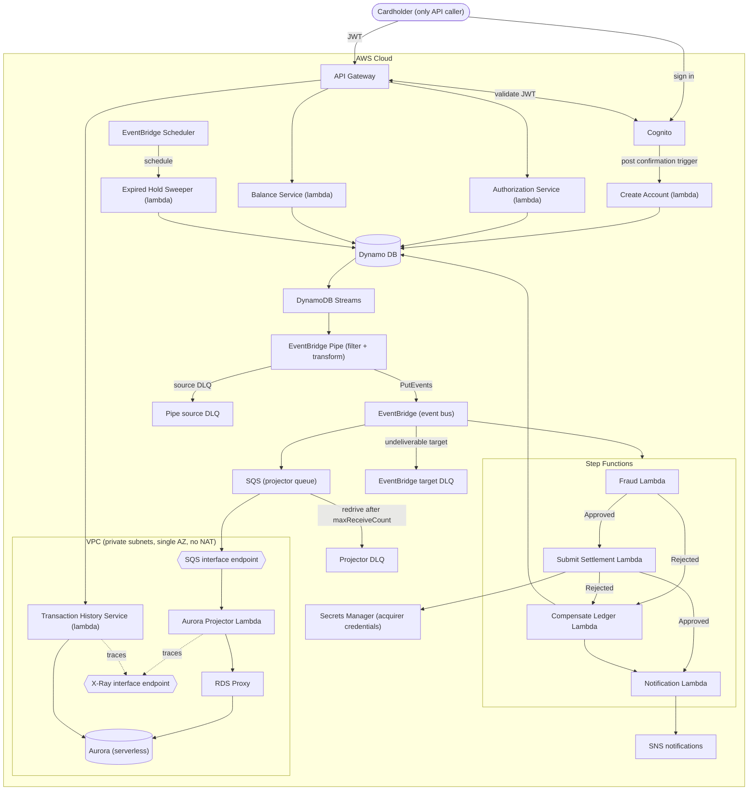

# Cloud Architecture



Balance reads go to DynamoDB with a strongly-consistent `GetItem`, not to Aurora — the non-functional requirement
says balance must always return the latest value, and Aurora is by construction an eventually-consistent derived
model. Transaction history goes to Aurora, where eventual consistency is acceptable.

## Data flow

**Authorizing payments**
1. A customer has $500 in their account.
2. Customer books a hotel room at $400
```
POST /authorizations
Authorization: Bearer <jwt>          // sub → account_id
Idempotency-Key: 7c3a1e2f-...
{
  "amount": 40000,        // cents
  "merchant_id": "mrch_456",
  "expires_in_days": 7
}
```
3. Write `Authorization` record for $400 with pending status. `current_balance` stays $500 (no money has moved).
`available_balance` becomes $100 ($500 - $400 hold).
The customer's other card swipes will now only succeed if they're ≤ $100.
4. Capture the payment. The capture takes no body — it is always for the full authorized amount.
```
POST /authorizations/{authId}/capture
Idempotency-Key: 9f2b4d1c-...
```
Update the authorization record status to captured. Write two new ledger entries (debit the account, credit the
merchant). `current_balance` becomes $100. `available_balance` stays $100 — the hold is released at the same moment
the money leaves, so the two changes cancel out.
5. Alternative, the payment gets canceled.
```
POST /authorizations/{authId}/void
Idempotency-Key: 3e8a7b5d-...
```
Update authorization record to voided. `current_balance` stays $500, `available_balance` goes back to $500.
6. Alternative, the capture is reversed by the saga (fraud flagged, or settlement permanently failed). Write a
balanced REVERSAL transaction, restore `current_balance` to $500 and `available_balance` to $500, and move the
authorization to `REVERSED`. The original ledger entries are never touched.
